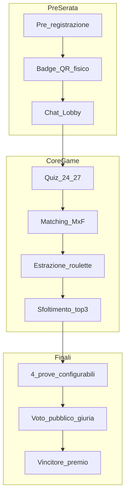

# Love Roulette — Master Specification v2

> Documento master unificato  
> Versione: 2.0 · Giugno 2026  
> Stato: **Approvato** — review completata 2026-06-19 · Milestone 1 dev in corso

---

## Executive Summary

**Love Roulette** è una piattaforma web full-stack per giochi interattivi live in sala dedicati a single. Ogni partecipante gioca individualmente via smartphone, completa un quiz di profilazione (24–27 domande), viene accoppiato algoritmicamente (M×F), e partecipa a uno show guidato dall'animatore fino alla proclamazione della coppia vincitrice (premio: Buono Vacanza).

**Scale v1**: ~30 smartphone per serata  
**Deploy**: URL dedicato per evento (`/s/{eventCode}`)  
**Stack**: Next.js 15 + Supabase + Vercel  
**Lingua**: Italiano

---

## 1. Documenti modulari

| Modulo | File | Contenuto |
|--------|------|-----------|
| Game Design | [01-game-design.md](01-game-design.md) | Fasi, state machine, regole |
| Design System | [02-design-system.md](02-design-system.md) | Temi, UI, animazioni |
| Architettura | [03-architecture.md](03-architecture.md) | Stack, DB, Realtime, API |
| Features | [04-features.md](04-features.md) | Funzionalità per milestone |
| Best Practices | [05-best-practices.md](05-best-practices.md) | GDPR, sicurezza, CI/CD |
| Question Bank | [06-question-bank.md](06-question-bank.md) | 27 domande esempio + branching |
| Runbook | [07-animator-runbook.md](07-animator-runbook.md) | Operatività sul campo |
| Test Scenarios | [08-test-scenarios.md](08-test-scenarios.md) | QA, edge cases |
| Decisions | [09-decisions-workshop.md](09-decisions-workshop.md) | Gap risolti + open items |
| Checklist | [printable/checklist-animatore.md](printable/checklist-animatore.md) | Stampabile |

**Documenti storici** (riferimento): `Love Game.odt`, PDF Specifiche, Linee Guida Animatori, Prompt Cursor.

---

## 2. Flusso di gioco



### State machine

`LOBBY → QUIZ → MATCHING → EXTRACTION → ELIMINATION → FINALS → WINNER → CLOSED`

---

## 3. Ruoli e permessi

| Ruolo | Device | Capabilities |
|-------|--------|--------------|
| Animatore | Tablet/PC | Controllo totale evento |
| Giocatore | Smartphone | Quiz, chat, presenza |
| Finalista | Smartphone + palco | Prove, no voto |
| Pubblico | Smartphone | Voto 3 coppie |
| Giuria (opt) | Smartphone staff | Voto pesato |
| Display | Proiettore | Animazioni pubbliche |

---

## 4. Decisioni chiave (brainstorming)

| Area | Decisione |
|------|-----------|
| Squadre | Nessuna — solo singoli |
| Registrazione | Pre-registrazione obbligatoria (email) |
| Estrazione | Animatore sceglie: random / classifica / ibrido |
| Prove palco | Ordine configurabile per serata |
| Votanti | Esclusi finali + giuria opzionale (pesi config) |
| Domande | Fisso + CRUD + branching + override realtime |
| Chat | Completa (M2 dev): anonima, moderazione, popup |
| Temi UI | Dark Fuchsia, Romantic Elegant, Neon Party |
| Affinità | Simple default; weighted/category avanzato M3 |
| Badge | Fisico + QR (M2) |
| Stats | Dashboard + proiettore + player — tutti configurabili |
| GDPR | Completo, retention 30gg, moderazione chat |
| Connettività | Hybrid cloud + offline vote queue M3 |
| Spareggio | Manuale animatore (default) |
| Admin animatore | Solo PIN 6 cifre v1 (no auth Supabase) |
| Dominio | `love-roulette.vercel.app` placeholder → `loveroulette.it` |
| Creazione eventi | Super-admin only v1 |
| Export dati | Fuori scope M1; altro progetto |
| Motore domande | Animator-first (override, pacing live) |
| Spicy L2 | Unlock con conferma esplicita animatore |
| UX mobile | Mobile spectacle max |
| Question pool | Target 100+; bozze AI + approvazione umana |

Dettaglio: [09-decisions-workshop.md](09-decisions-workshop.md)

---

## 5. Architettura tecnica (sintesi)

### Stack

- **Frontend**: Next.js 15, React 19, TypeScript, Tailwind, shadcn/ui
- **Backend**: Supabase (PostgreSQL, Auth, Realtime)
- **Hosting**: Vercel + Supabase Cloud

### Routes principali

```
/register/[eventCode]     → Pre-registrazione
/s/[eventCode]            → Join giocatore
/s/[eventCode]/play       → Client gioco
/s/[eventCode]/display    → Proiettore
/admin/[eventCode]        → Dashboard animatore
```

### Realtime events

`state_changed`, `question_show`, `next_couple_spin`, `couple_revealed`, `switch_to_voting`, `submit_vote`, `winner_announced`

Dettaglio: [03-architecture.md](03-architecture.md)

---

## 6. Schema dati (core)

Entità principali: `events`, `players`, `questions`, `question_options`, `answers`, `pairs`, `votes`, `jury_votes`, `chat_messages`

Config evento centralizzata in `events.config` (JSON):

```json
{
  "extraction_mode": "random",
  "challenge_order": ["dance", "kiss", "declaration", "kamasutra"],
  "stats_visibility": { "animator_dashboard": true, "projector": false, "player_feedback": true },
  "chat_enabled": true,
  "jury_enabled": false,
  "jury_weight": 0.3,
  "public_weight": 0.7,
  "theme": "dark_fuchsia",
  "tie_breaker": "animator_manual",
  "data_retention_days": 30
}
```

---

## 7. Roadmap sviluppo

### Milestone 1 — Core Game (MVP giocabile)

- Pre-reg + join `/s/{code}`
- Quiz fisso 24–27 domande, sync realtime
- Matching simple + estrazione 3 modalità
- Display roulette + sfoltimento top 3
- 4 prove + voto pubblico
- Tema Dark Fuchsia
- Dashboard animatore base

### Milestone 2 — Social & Admin

- Chat completa + moderazione
- CRUD domande + branching + override realtime
- Stats live configurabili
- Badge QR fisico
- Temi Romantic + Neon
- ~~Export CSV~~ → fuori scope (altro progetto)

### Milestone 3 — Polish

- Giuria pesata
- Offline vote queue
- Affinity avanzato
- Rehearsal mode
- Load test 30 utenti

Dettaglio feature matrix: [04-features.md](04-features.md)

---

## 8. Design (sintesi)

- **Dark-first**, touch target 48px+, proiettore font 64px+
- **Roulette**: 3–5 sec spin, cuori rotanti, reveal nickname
- **3 temi** switchabili per evento

Dettaglio: [02-design-system.md](02-design-system.md)

---

## 9. Sicurezza e compliance

- GDPR: consensi, retention 30gg, export, cancellazione
- Moderazione chat: filtri + ban + audit log
- Rate limit voti: 1/prova/giocatore
- RLS Supabase per isolamento evento

Dettaglio: [05-best-practices.md](05-best-practices.md)

---

## 10. QA

- E2E happy path 12 giocatori
- Edge cases: disparità M/F, parità voti, disconnect
- Load: 30 connessioni Realtime

Dettaglio: [08-test-scenarios.md](08-test-scenarios.md)

---

## 11. Operatività

Timeline serata, script animatore, troubleshooting: [07-animator-runbook.md](07-animator-runbook.md)

Checklist stampabile: [printable/checklist-animatore.md](printable/checklist-animatore.md)

---

## 12. Review checklist (per Mauro)

- [x] Flusso di gioco e fasi approvati
- [x] Stack Next.js + Supabase accettato
- [x] Roadmap 3 milestone OK
- [x] Domande esempio (06) — tono e contenuto OK
- [x] Open items §15 risolti — vedi addendum §15
- [x] Priorità M1 scope sufficiente per prima serata pilota

---

## 13. Changelog v2

| Data | Modifica |
|------|----------|
| 2026-06-19 | Creazione master spec v2 da 4 documenti originali + brainstorming |
| 2026-06-19 | Risolte discrepanze ordine prove, estrazione, votanti |
| 2026-06-19 | Aggiunti chat, badge, stats, giuria, temi multipli |
| 2026-06-19 | Review §15 risolta; addendum §15; brainstorming animator-first, Spicy L2, mobile spectacle, pool 100+ |

---

## 14. Prossimo passo tecnico

Repo scaffold: `web/` con Next.js, Supabase migrations, route `/s/[eventCode]`.

Vedi README root progetto.

---

## 15. Addendum post-review (2026-06-19)

Decisioni §15 [09-decisions-workshop.md](09-decisions-workshop.md) e brainstorming §16:

| # | Area | Decisione v1 |
|---|------|--------------|
| A | Dominio | Placeholder `love-roulette.vercel.app` fino ad acquisto `loveroulette.it` |
| B | Admin animatore | Solo PIN 6 cifre — **no auth Supabase** per dashboard |
| C | Pre-reg | Solo email; telefono/WhatsApp milestone successiva |
| D | Eventi | Creazione **super-admin only** |
| E | Export | **Nessun export M1** — integrazione in altro progetto |
| — | Motore domande | Animator-first |
| — | Spicy L2 | Unlock con conferma animatore |
| — | UX | Mobile spectacle max |
| — | Pool | 50 → 100+ domande; bozze AI + approvazione umana |
