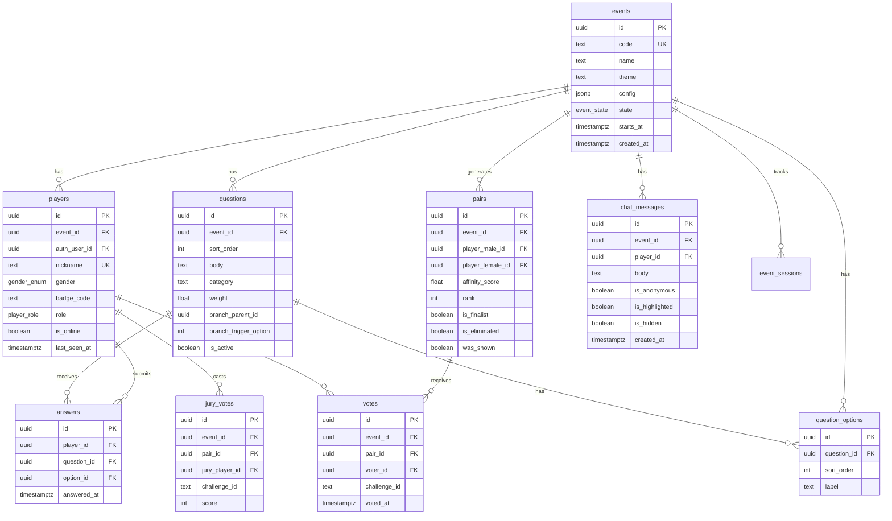
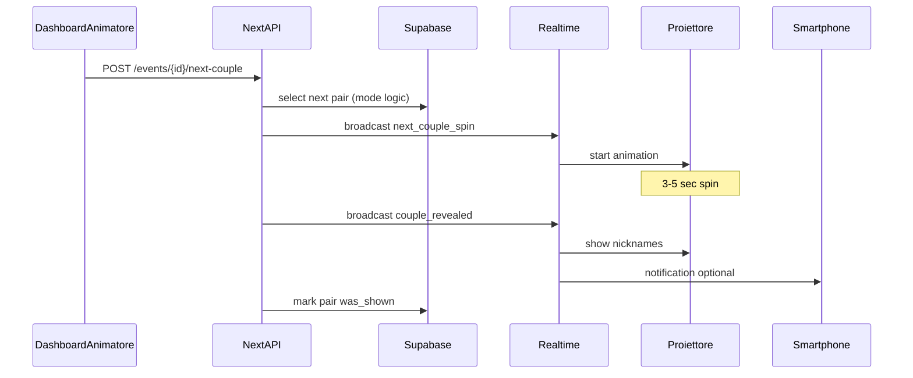

# Love Roulette — Architettura Tecnica

> Modulo 03 · Stack, database, realtime, API  
> Versione: 2.0 · Giugno 2026

## 1. Stack tecnologico

| Layer | Tecnologia | Note |
|-------|------------|------|
| Frontend | Next.js 15 (App Router) + React 19 + TypeScript | PWA, SSR display |
| Styling | Tailwind CSS 4 + shadcn/ui | Temi via CSS variables |
| Animazioni | Framer Motion + canvas-confetti | |
| Backend | Supabase (PostgreSQL 15) | RLS multi-tenant per evento |
| Auth | Supabase Auth | Email magic link pre-registrazione |
| Realtime | Supabase Realtime (postgres_changes + broadcast) | |
| Hosting | Vercel (frontend) + Supabase Cloud (backend) | |
| Offline | Service Worker + IndexedDB vote queue | M3 |

---

## 2. Routing applicazione

```
/                           → Landing / info prodotto
/register/[eventCode]       → Pre-registrazione evento
/s/[eventCode]              → Join giocatore (login evento)
/s/[eventCode]/play         → Client giocatore (quiz, voto, chat)
/s/[eventCode]/display      → Display proiettore (fullscreen)
/admin/[eventCode]          → Dashboard animatore (auth staff)
/admin/[eventCode]/rehearsal → Modalità prova
/api/events/...             → Route handlers Next.js
```

---

## 3. Schema database

### 3.1 Diagramma ER



### 3.2 Enums

```sql
CREATE TYPE event_state AS ENUM (
  'lobby', 'quiz', 'matching', 'extraction',
  'elimination', 'finals', 'winner', 'closed'
);

CREATE TYPE gender_enum AS ENUM ('male', 'female');

CREATE TYPE player_role AS ENUM (
  'player', 'finalist', 'audience', 'jury', 'animator'
);
```

### 3.3 Row Level Security

- **players**: read/write own row; animators read all in event.
- **answers**: insert own; no update after submit.
- **votes**: insert once per (voter, challenge_id); unique constraint.
- **chat_messages**: insert own; animators moderate all.
- **pairs/votes aggregate**: read via RPC for animators; public display via broadcast only.

---

## 4. Algoritmo affinità

### 4.1 Modalità simple (default)

```
affinity(m, f) = (matching_answers / total_questions) × 100
```

Domande saltate/inattive escluse dal denominatore.

### 4.2 Modalità weighted

```
affinity = Σ(match_i × weight_i) / Σ(weight_i) × 100
```

### 4.3 Modalità category

Calcolo per categoria (romanticismo, avventura, lifestyle), poi media pesata categorie. Dashboard animatore mostra breakdown radar opzionale.

### 4.4 Pipeline matching

```typescript
async function computePairs(eventId: string): Promise<Pair[]> {
  const males = await getPlayers(eventId, 'male');
  const females = await getPlayers(eventId, 'female');
  const questions = await getActiveQuestions(eventId);
  const answers = await getAnswersMap(eventId);

  const pairs: Pair[] = [];
  for (const m of males) {
    for (const f of females) {
      const score = calculateAffinity(m, f, questions, answers, config.algorithm);
      pairs.push({ maleId: m.id, femaleId: f.id, score });
    }
  }
  return pairs.sort((a, b) => b.score - a.score).map((p, i) => ({ ...p, rank: i + 1 }));
}
```

Trigger: transizione `quiz → matching` via Edge Function o Next.js API route.

---

## 5. Realtime — Eventi tipizzati

### 5.1 Broadcast channels

Canale: `event:{eventId}`

| Evento | Payload | Mittente | Destinatari |
|--------|---------|----------|-------------|
| `state_changed` | `{ state, config }` | Admin | Tutti |
| `question_show` | `{ questionId, index, total }` | Admin | Players + display |
| `question_stats` | `{ questionId, percentages[] }` | Server | Display + players (se config) |
| `matching_complete` | `{ pairCount }` | Server | Admin |
| `next_couple_spin` | `{ pairId?, animationMs }` | Admin | Display |
| `couple_revealed` | `{ pairId, maleNick, femaleNick, score? }` | Server | Display + players |
| `couple_eliminated` | `{ pairId }` | Admin/Server | Display |
| `finalists_set` | `{ pairs[3] }` | Server | Tutti |
| `challenge_started` | `{ challengeId, name, order }` | Admin | Tutti |
| `switch_to_voting` | `{ challengeId, open: boolean }` | Admin | Audience phones |
| `vote_count_update` | `{ challengeId, counts[3] }` | Server | Admin (live) |
| `winner_announced` | `{ pairId, totalVotes }` | Admin | Display + tutti |
| `chat_highlight` | `{ messageId }` | Admin | Display (popup) |
| `player_presence` | `{ onlineCount }` | Server | Admin |

### 5.2 Sequence — Estrazione coppia



---

## 6. API principali

| Method | Endpoint | Descrizione |
|--------|----------|-------------|
| POST | `/api/events` | Crea evento (admin) |
| GET | `/api/events/[code]` | Info evento pubblica |
| POST | `/api/events/[code]/register` | Pre-registrazione |
| POST | `/api/events/[code]/join` | Join con badge/nick |
| POST | `/api/events/[code]/answers` | Submit risposta quiz |
| POST | `/api/events/[code]/match` | Trigger matching (admin) |
| POST | `/api/events/[code]/next-couple` | Estrazione (admin) |
| POST | `/api/events/[code]/eliminate` | Elimina coppia (admin) |
| POST | `/api/events/[code]/vote` | Voto pubblico |
| POST | `/api/events/[code]/jury-vote` | Voto giuria |
| POST | `/api/events/[code]/state` | Cambio stato (admin) |
| GET | `/api/events/[code]/export` | CSV post-serata (admin) |
| POST | `/api/events/[code]/chat` | Invio messaggio |
| PATCH | `/api/events/[code]/chat/[id]` | Moderazione (admin) |

---

## 7. Hybrid connectivity

### Online (default)

Tutte le operazioni via Supabase + Realtime.

### Degradazione (M3)

1. Service Worker cache shell app (PWA).
2. Voti in coda IndexedDB se offline durante `switch_to_voting`.
3. Retry exponential backoff; sync batch al reconnect.
4. Display proiettore: ultimo stato cached + banner "riconnessione...".

### Rete locale (future)

Hotspot dedicato animatore + DNS locale opzionale; v1 cloud-only con retry.

---

## 8. Sicurezza

- Event code: 6 char alfanumerico uppercase (es. `ABC123`).
- Admin auth: Supabase role `animator` o PIN evento secondario.
- Rate limits: 1 vote/challenge/player, 10 chat msg/min, 60 answer/min/event.
- CSP strict su display route.
- Sanitize chat server-side (XSS).

---

## 9. Environment variables

```env
NEXT_PUBLIC_SUPABASE_URL=
NEXT_PUBLIC_SUPABASE_ANON_KEY=
SUPABASE_SERVICE_ROLE_KEY=
NEXT_PUBLIC_APP_URL=https://loveroulette.it
```

---

## 10. Struttura repo (M1 scaffold)

```
love-roulette/
├── app/
│   ├── page.tsx
│   ├── register/[eventCode]/page.tsx
│   ├── s/[eventCode]/
│   │   ├── page.tsx
│   │   ├── play/page.tsx
│   │   └── display/page.tsx
│   ├── admin/[eventCode]/page.tsx
│   └── api/events/[code]/...
├── components/
│   ├── display/
│   ├── player/
│   └── admin/
├── lib/
│   ├── supabase/
│   ├── matching/
│   └── realtime/
├── supabase/
│   └── migrations/
└── docs/
```

---

## 11. Riferimenti

- Game design → [01-game-design.md](01-game-design.md)
- Best practices → [05-best-practices.md](05-best-practices.md)
- Test → [08-test-scenarios.md](08-test-scenarios.md)
