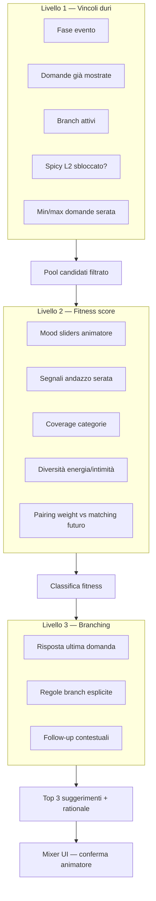
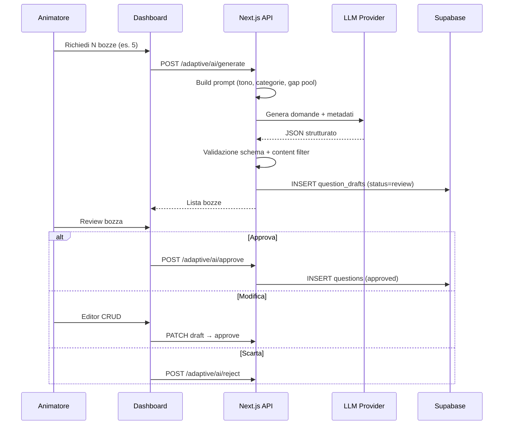

# Love Roulette — Domande Adattive e Mobile Spectacle

> Modulo 10 · Motore adattivo, mixer animatore, second screen, slide dinamiche  
> Versione: 1.0 · Giugno 2026

Questo documento estende il modello quiz descritto in [01-game-design.md](01-game-design.md) e [04-features.md](04-features.md) con un **motore di sessione adattiva** controllato dall'animatore, un pool di domande ricco di metadati ([06-question-bank.md](06-question-bank.md)), effetti mobile ad alto impatto e slide proiettore generate in tempo reale in base all'**andazzo serata**.

**Principio guida**: il sistema *suggerisce*, l'animatore *conferma*. Nessuna domanda o effetto spettacolare parte senza approvazione esplicita dalla dashboard.

---

## 1. Adaptive Session Engine

Il motore adattivo seleziona la prossima domanda (o branch) durante la fase `QUIZ` analizzando lo stato della serata, i metadati del pool e le preferenze dell'animatore. L'output non è una scelta automatica: sono **3 suggerimenti ordinati** che l'animatore può confermare, forzare un'altra domanda o rigenerare.

### 1.1 Panoramica a tre livelli



### 1.2 Livello 1 — Vincoli duri (Hard Constraints)

Il filtro iniziale esclude domande non ammissibili. Nessun punteggio viene calcolato su candidati esclusi.

| Vincolo | Regola | Fonte |
|---------|--------|-------|
| Stato evento | Solo in `quiz`; slide dinamiche anche in `lobby`, `extraction`, `finals` | [01-game-design.md](01-game-design.md) §3 |
| Domande attive | `is_active = true` e `status = approved` | Pool DB |
| Unicità sessione | Domanda già `shown` in questa sessione → esclusa (salvo `force_repeat` animatore) | Session state |
| Target conteggio | Default 24–27 domande; min 20, max 32 configurabile in `events.config` | [01-game-design.md](01-game-design.md) §4 |
| Intimità massima | `intimacy_level ≤ session.max_intimacy` | Mixer + unlock Spicy L2 |
| Spicy L2 | Domande con `spicy_tier = 2` visibili solo se `session.spicy_l2_unlocked = true` | Conferma animatore |
| Branch depth | Max 5 livelli per percorso ([04-features.md](04-features.md) §2.3) | Albero branching |
| Cicli | Domande che creerebbero ciclo nel grafo branch → escluse | Validazione grafo |
| Lingua | Solo `locale = it` in v1 | [09-decisions-workshop.md](09-decisions-workshop.md) §13 |
| Contenuto | `moderation_flag = none` per suggerimenti automatici | Content policy |

**Output L1**: insieme `C` di domande candidate (tipicamente 30–80 su pool da 50–100+).

### 1.3 Livello 2 — Fitness score

Per ogni domanda `q ∈ C` si calcola un punteggio normalizzato `0.0–1.0`:

```
fitness(q) = w_mood × moodMatch(q)
           + w_energy × energyMatch(q)
           + w_coverage × categoryCoverage(q)
           + w_diversity × diversityBonus(q)
           + w_signal × salonSignalBoost(q)
           + w_pairing × pairingAlignment(q)
```

Pesi default (sovrascrivibili per evento in `events.config.adaptive_weights`):

| Componente | Peso default | Descrizione |
|------------|:------------:|-------------|
| `moodMatch` | 0.35 | Allineamento a slider Relax / Romance / Spicy |
| `energyMatch` | 0.15 | Coerenza con ritmo serata (lenta vs frenetica) |
| `categoryCoverage` | 0.15 | Bonus categorie sotto-rappresentate nella sessione |
| `diversityBonus` | 0.10 | Penalità ripetizione tag o tono simile alle ultime 3 domande |
| `salonSignalBoost` | 0.15 | Boost da segnali andazzo (§6) |
| `pairingAlignment` | 0.10 | Allineamento a `pairing_weight` per affinità futura |

#### Mood sliders (input animatore)

Tre slider `0–100` sulla dashboard, normalizzati a vettore mood:

| Slider | Effetto sul matching |
|--------|----------------------|
| **Relax** | Preferisce `energy ≤ 40`, `intimacy_level ≤ 2`, categorie `lifestyle`, `fun` |
| **Romance** | Preferisce `mood_vector.romance ≥ 0.6`, categorie `romantic`, `values` |
| **Spicy** | Preferisce `mood_vector.spicy ≥ 0.5`, `intimacy_level ≥ 3`; L2 solo se sbloccato |

I tre slider non sono mutuamente esclusivi: il motore interpreta la combinazione come blend (es. Relax 70 + Romance 30 → serata morbida con sfumatura romantica).

#### Segnali andazzo serata (input automatico)

Metriche aggregate aggiornate dopo ogni domanda (vedi §6.1):

- **response_speed**: mediana secondi per risposta (ultime 5 domande)
- **participation_rate**: % giocatori che hanno risposto entro timeout
- **consensus_index**: entropia distribuzione risposte (alta = sala divisa, bassa = consenso)
- **chat_velocity**: messaggi/min in lobby (se chat attiva)
- **animator_overrides**: conteggio skip/force ultimi 10 min

Questi segnali alimentano `salonSignalBoost` e le slide dinamiche.

### 1.4 Livello 3 — Branching

Dopo il ranking L2, il motore applica regole di branch con **priorità assoluta** sul punteggio fitness:

1. **Branch esplicito**: se la risposta maggioritaria (o risposta animatore in override) su domanda `Q_prev` attiva `branch_parent_id` + `branch_trigger_option` → la domanda figlia entra in suggerimenti con badge `BRANCH` e score forzato a 1.0.
2. **Follow-up contestuale**: domande con `phase_hint = follow_up` e `tags` sovrapposti alla domanda precedente ricevono +0.2 al fitness.
3. **Dead branch**: se il branch punta a domanda già mostrata o esclusa da L1 → branch ignorato, log su dashboard.

**Regola animatore-first**: anche un branch ad alta priorità compare come **suggerimento #1** con pulsante Conferma; l'animatore può rifiutare e scegliere un'altra opzione.

### 1.5 Persistenza stato sessione

Estensione `event_sessions` (o documento JSON in `events.config` per M1 semplificato):

```typescript
interface AdaptiveSessionState {
  questions_shown: string[];           // question IDs
  mood_sliders: { relax: number; romance: number; spicy: number };
  spicy_l2_unlocked: boolean;
  max_intimacy: 1 | 2 | 3 | 4;
  category_counts: Record<string, number>;
  salon_signals: SalonSignals;
  last_suggestions: SuggestionPack | null;
  ai_drafts_pending: string[];
}

interface SuggestionPack {
  generated_at: string;
  suggestions: Array<{
    question_id: string;
    fitness: number;
    rationale: string;       // breve testo per animatore
    badges: ('BRANCH' | 'MOOD' | 'SIGNAL' | 'AI_NEW')[];
  }>;
}
```

### 1.6 API e realtime

| Endpoint / evento | Ruolo |
|-------------------|-------|
| `POST /api/events/[code]/adaptive/suggest` | Ricalcola top 3 suggerimenti |
| `POST /api/events/[code]/adaptive/confirm` | Animatore conferma domanda → broadcast `question_show` |
| `POST /api/events/[code]/adaptive/force` | Forza domanda by ID (bypass ranking) |
| `PATCH /api/events/[code]/adaptive/mood` | Aggiorna slider + opz. ricalcolo |
| `POST /api/events/[code]/adaptive/unlock-spicy-l2` | Sblocco esplicito Spicy L2 |
| Broadcast `adaptive_suggestions` | Payload `SuggestionPack` → solo admin channel |

Canale admin: `event:{eventId}:admin` (separato dal broadcast giocatori per non leakare domande future). Ref. pattern realtime: [03-architecture.md](03-architecture.md) §5.

---

## 2. Schema metadati domanda

Ogni domanda nel pool — seed, CRUD admin o bozza AI — deve rispettare lo schema esteso sotto. I campi obbligatori per M1 restano `body`, `options`, `category`, `weight`; i campi adattivi sono **obbligatori dal pool da 50** (M2).

### 2.1 Modello completo

```json
{
  "id": "q_rom_12",
  "body": "Il gesto che ti fa sciogliere è...",
  "category": "romantic",
  "weight": 1.2,
  "options": [
    { "id": "a", "label": "Una lettera scritta a mano" },
    { "id": "b", "label": "Una sorpresa improvvisata" },
    { "id": "c", "label": "Ballare senza musica" },
    { "id": "d", "label": "Guardare le stelle insieme" }
  ],

  "mood_vector": {
    "relax": 0.3,
    "romance": 0.85,
    "spicy": 0.15
  },
  "energy": 35,
  "intimacy_level": 2,
  "spicy_tier": 0,
  "phase_hint": "mid_quiz",
  "pairing_weight": 1.0,
  "tags": ["gesti", "romanticismo", "emozione"],
  "locale": "it",
  "status": "approved",
  "source": "seed",
  "moderation_flag": "none",

  "branch_parent_id": null,
  "branch_trigger_option": null,
  "estimated_seconds": 12,
  "projector_stats_ok": true,
  "mobile_effect_hint": "soft_pulse",

  "created_at": "2026-06-01T10:00:00Z",
  "approved_by": "animator_uuid",
  "approved_at": "2026-06-01T11:00:00Z"
}
```

### 2.2 Definizione campi

| Campo | Tipo | Range / valori | Uso motore |
|-------|------|------------------|------------|
| `mood_vector` | object | Ogni chiave 0.0–1.0; somma non richiesta = 1 | `moodMatch` vs slider animatore |
| `energy` | int | 0–100 | Ritmo serata; basso = riflessiva, alto = party |
| `intimacy_level` | int | 1–4 | 1=superficiale, 4=molto personale (mai esplicito) |
| `spicy_tier` | int | 0, 1, 2 | 0=neutro, 1=giocoso, 2=audace (richiede unlock L2) |
| `phase_hint` | enum | `opener`, `mid_quiz`, `closer`, `follow_up`, `wildcard` | Sequenza narrativa quiz |
| `pairing_weight` | float | 0.5–2.0 | Moltiplicatore peso in matching ([03-architecture.md](03-architecture.md) §4.2) |
| `tags` | string[] | max 8 tag | Diversità, follow-up, filtri AI |
| `category` | enum | `lifestyle`, `romantic`, `adventure`, `values`, `fun`, `intimacy` | Coverage + affinità per categoria |
| `weight` | float | 0.5–2.0 | Matching (esistente) |
| `status` | enum | `draft`, `review`, `approved`, `archived` | Solo `approved` in suggerimenti auto |
| `source` | enum | `seed`, `admin`, `ai_generated` | Tracciabilità |
| `moderation_flag` | enum | `none`, `review_needed`, `blocked` | Gate contenuti |
| `projector_stats_ok` | bool | — | Se false, stats live solo su dashboard |
| `mobile_effect_hint` | enum | vedi §5.3 | Suggerimento effetto second screen |
| `estimated_seconds` | int | 5–30 | Stima durata; usata per segnali ritmo |

### 2.3 Vincoli di contenuto (allineamento banca domande)

- Tono **divertito-ironico**, mai volgare ([06-question-bank.md](06-question-bank.md) §1).
- `intimacy_level = 4` e `spicy_tier = 2` richiedono doppia approvazione: flag in DB + tap esplicito animatore pre-serata o unlock live.
- 4 opzioni sempre bilanciate; nessuna domanda con risposta "ovvia".

### 2.4 Pool iniziale e scala

| Fase pool | Target | Composizione |
|-----------|--------|--------------|
| Launch M2 | **50 domande** `approved` | Copertura minima: 8–10 per categoria principale, tutti i `phase_hint`, mix energy 20–80 |
| Crescita M2–M3 | **100+ domande** | +30 AI draft approvati, +20 varianti branch |
| Per evento | 24–27 attive | Motore seleziona da pool globale o pool custom evento |

Import JSON esteso: vedi [06-question-bank.md](06-question-bank.md) §5; aggiungere sezione `metadata_version: 2`.

### 2.5 Estensione schema DB

Migration suggerita su tabella `questions`:

```sql
ALTER TABLE questions ADD COLUMN IF NOT EXISTS mood_vector jsonb DEFAULT '{"relax":0.33,"romance":0.33,"spicy":0.34}';
ALTER TABLE questions ADD COLUMN IF NOT EXISTS energy int DEFAULT 50;
ALTER TABLE questions ADD COLUMN IF NOT EXISTS intimacy_level int DEFAULT 2;
ALTER TABLE questions ADD COLUMN IF NOT EXISTS spicy_tier int DEFAULT 0;
ALTER TABLE questions ADD COLUMN IF NOT EXISTS phase_hint text DEFAULT 'mid_quiz';
ALTER TABLE questions ADD COLUMN IF NOT EXISTS pairing_weight float DEFAULT 1.0;
ALTER TABLE questions ADD COLUMN IF NOT EXISTS tags text[] DEFAULT '{}';
ALTER TABLE questions ADD COLUMN IF NOT EXISTS status text DEFAULT 'approved';
ALTER TABLE questions ADD COLUMN IF NOT EXISTS source text DEFAULT 'seed';
ALTER TABLE questions ADD COLUMN IF NOT EXISTS mobile_effect_hint text;
```

Tabella aggiuntiva `question_drafts` per bozze AI (§4).

---

## 3. Animator Mixer UI

La **Mixer UI** è il pannello quiz nella dashboard animatore ([04-features.md](04-features.md) §6) che sostituisce il flusso lineare "Avanti → prossima domanda in ordine" quando `events.config.question_mode = adaptive`.

### 3.1 Layout pannello

```
┌─────────────────────────────────────────────────────────────────┐
│  QUIZ ADATTIVO · Domanda 14 di ~26 · 2:34 media risposta        │
├─────────────────────────────────────────────────────────────────┤
│  MOOD MIXER                                                      │
│  Relax    [========●====] 62    Romance [======●======] 48       │
│  Spicy    [===●=========] 28    [🔒 Sblocca Spicy L2]           │
├─────────────────────────────────────────────────────────────────┤
│  PRESET RAPIDI                                                   │
│  [Icebreaker] [Romantic Peak] [Party Energy] [Wind Down] [Custom]│
├─────────────────────────────────────────────────────────────────┤
│  SUGGERIMENTI (tap per confermare)                               │
│  ┌─ #1 · fitness 0.91 · BRANCH ─────────────────────────────┐   │
│  │ "Cosa consideri un segno di intelligenza?"               │   │
│  │ romantic · energy 40 · intimacy 2 · ~11s                 │   │
│  │ Perché: branch da Q7 opzione B + mood romance alto       │   │
│  │                              [CONFERMA ▶]                │   │
│  └──────────────────────────────────────────────────────────┘   │
│  ┌─ #2 · fitness 0.84 · MOOD ───────────────────────────────┐   │
│  │ "Il gesto romantico perfetto?"                           │   │
│  │ ...                                      [CONFERMA ▶]    │   │
│  └──────────────────────────────────────────────────────────┘   │
│  ┌─ #3 · fitness 0.79 · SIGNAL ─────────────────────────────┐   │
│  │ "Karaoke: ci saliresti?"                                 │   │
│  │ ...                                      [CONFERMA ▶]    │   │
│  └──────────────────────────────────────────────────────────┘   │
├─────────────────────────────────────────────────────────────────┤
│  [🔄 Rigenera]  [📋 Scegli dal pool]  [⚡ Forza ID]  [⏭ Skip]   │
│  [➕ Inserisci extra]  [⏸ Pausa quiz]                            │
├─────────────────────────────────────────────────────────────────┤
│  ANDAZZO · partecipazione 94% · consenso medio · chat 🔥        │
│  💡 Slide suggerita: "La sala è divisa!" [Mostra] [Ignora]      │
└─────────────────────────────────────────────────────────────────┘
```

### 3.2 Mood sliders

| Controllo | Comportamento |
|-----------|---------------|
| Slider Relax / Romance / Spicy | Aggiornamento realtime; debounce 300ms poi `PATCH mood` + auto-ricalcolo suggerimenti |
| Preset rapidi | Impostano terne predefinite; es. **Party Energy** → Relax 10, Romance 20, Spicy 55, energy bias alto |
| Custom | Salva preset in `events.config.mood_presets` per riuso stesso locale |
| Indicatore blend | Icona o mini-radar che mostra il mood risultante della sessione |

### 3.3 Spicy L2 — unlock controllato

1. Domande `spicy_tier = 2` non compaiono in suggerimenti finché `spicy_l2_unlocked = false`.
2. Pulsante **Sblocca Spicy L2** apre modale di conferma:
   - Testo: "Stai per abilitare domande più audaci (sempre non esplicite). Confermi per questa serata?"
   - Richiede doppio tap o hold 2s (anti tap accidentale).
3. Opzionale: re-lock durante quiz con conferma (es. prima di fase estrazione).

### 3.4 Flusso 3 suggerimenti + force

| Azione | Effetto |
|--------|---------|
| **Conferma** su #1/#2/#3 | `POST confirm` → `question_show` a tutti i client |
| **Rigenera** | Nuovo `suggest` escludendo pack precedente (evita stessi 3) |
| **Scegli dal pool** | Modale filtrabile per categoria, tag, energy; lista non ordinata per fitness |
| **Forza ID** | Bypass completo motore; log `animator_force` per analytics |
| **Skip** | Nessuna domanda; avanza stato senza incrementare `questions_shown` |
| **Inserisci extra** | Aggiunge one-shot in coda manuale (M2 esistente, [04-features.md](04-features.md) §2.4) |

Dopo conferma: pannello mostra stats live (se config), countdown partecipazione, prossimo ciclo suggerimenti quando ≥80% ha risposto o timeout.

### 3.5 Flusso approvazione bozze AI

Sezione collassabile **Bozze AI in attesa** (badge contatore):

```
┌─ Bozza AI #DRF-882 ─────────────────────────────────────────┐
│ "Se potessi mandare un vocale a mezzanotte..."               │
│ fun · spicy_tier 1 · energy 65 · tags: [notte, messaggi]    │
│ [✓ Approva nel pool]  [✎ Modifica]  [✗ Scarta]  [Anteprima] │
└──────────────────────────────────────────────────────────────┘
```

- **Approva**: `status → approved`, entra nel pool, disponibile ai suggerimenti dalla domanda successiva.
- **Modifica**: apre editor CRUD con metadati pre-compilati dall'AI.
- **Scarta**: `archived` con motivo opzionale.

Dettaglio pipeline AI: §4.

### 3.6 Accessibilità e fail-safe

- Se motore non risponde in 2s: fallback a lista ordinata pool (modalità fixed legacy).
- Rehearsal mode ([04-features.md](04-features.md) §6.3): suggerimenti visibili con bot; unlock Spicy simulabile.
- Tablet landscape first; controlli critici ≥48px ([02-design-system.md](02-design-system.md)).

---

## 4. Workflow generazione domande AI

L'AI **non pubblica mai** domande live. Produce bozze in `question_drafts` che l'animatore approva, modifica o scarta.

### 4.1 Diagramma flusso



### 4.2 Prompt e vincoli generazione

Input al modello:

- Tono e regole da [06-question-bank.md](06-question-bank.md) §1
- Gap analysis pool: categorie sotto-rappresentate, energy mancanti, tag richiesti
- Mood target corrente dagli slider (opzionale)
- Esempi 3–5 domande `approved` come few-shot
- Vincolo output: JSON array schema §2.1, nessun testo fuori schema

Post-processing server-side:

| Check | Azione se fallisce |
|-------|-------------------|
| Schema JSON valido | Rigenera singola domanda (max 2 retry) |
| 4 opzioni presenti | Rigenera |
| Lista parole vietate / volgari | `moderation_flag = review_needed` |
| `intimacy_level > 3` o `spicy_tier = 2` | Forza `status = review`, mai auto-approve |
| Duplicato semantico (embedding similarity > 0.92) | Scarta con log |

### 4.3 Modello dati bozze

```sql
CREATE TABLE question_drafts (
  id uuid PRIMARY KEY DEFAULT gen_random_uuid(),
  event_id uuid REFERENCES events(id),
  payload jsonb NOT NULL,
  generation_prompt_hash text,
  moderation_flag text DEFAULT 'none',
  status text DEFAULT 'review',
  created_at timestamptz DEFAULT now(),
  reviewed_by uuid,
  reviewed_at timestamptz
);
```

### 4.4 Quota e costi

- Max **10 bozze per richiesta**, max **30 bozze per evento** per serata (configurabile).
- Generazione solo ruolo `animator` o `super-admin`.
- Log token/costo in tabella audit (M3).

### 4.5 Integrazione pool

Dopo approvazione:

1. Domanda copiata in `questions` con `source = ai_generated`.
2. Motore adattivo include nel pool L1 al prossimo `suggest`.
3. Export post-serata include flag `source` per analytics ([04-features.md](04-features.md) §8).

---

## 5. Mobile second screen — specifica spettacolo

Il telefono del giocatore è **second screen** sincronizzato con il proiettore: non duplica le informazioni del display sala, ma amplifica emozione, feedback personale e momenti di climax (estrazione coppia, finale).

### 5.1 Modalità display mobile

| Modalità | Stato evento | Comportamento schermo |
|----------|--------------|------------------------|
| `quiz_default` | QUIZ | Domanda + opzioni; effetti leggeri per `mobile_effect_hint` |
| `ambient_mode` | LOBBY, attese, pause | Onde colore lente, logo evento, chat badge; batteria-friendly |
| `stats_reveal` | Post-risposta | "Il 67% ha risposto come te" + micro-celebrazione |
| `extraction_personal` | EXTRACTION | Profilo emergente, haptic, attesa spin |
| `screen_takeover` | Coppia estratta (se coinvolto) | Fullscreen takeover 5–8s |
| `finalist_hero` | FINALS | Schermata "Sei in finale!" con effetti intensi |
| `vote_mode` | VOTING | UI voto (esistente M1) con pulse leggero sui bottoni |

### 5.2 Eventi realtime `screen_effect`

Estensione canale `event:{eventId}` ([03-architecture.md](03-architecture.md) §5):

| Evento | Payload | Destinatari |
|--------|---------|-------------|
| `ambient_mode` | `{ variant: 'waves' \| 'hearts' \| 'minimal', theme }` | Tutti i player |
| `screen_effect` | `{ effect, intensity, duration_ms, target?: player_ids }` | Players (filtrato se target) |
| `sync_wave` | `{ color, origin: 'projector' \| 'server', phase_ms }` | Tutti — onda sincronizzata |
| `personal_reveal` | `{ player_id, nickname, badge_code? }` | Singolo player |
| `takeover_start` / `takeover_end` | `{ pair_id, maleNick, femaleNick, duration_ms }` | Pair members + opz. tutti |

### 5.3 Catalogo effetti personali

| `effect` | Descrizione | `mobile_effect_hint` | Haptic |
|----------|-------------|----------------------|--------|
| `soft_pulse` | Bordo accent pulsante 2s | default quiz romance | light |
| `color_wave` | Onda gradient attraversa schermo | relax, opener | none |
| `confetti_burst` | canvas-confetti leggero | fun, high energy | medium |
| `heart_rain` | Particelle cuore | romantic peak | light |
| `neon_flash` | Flash tema Neon Party | party energy | heavy |
| `profile_emerge` | Avatar/nick emerge da blur | extraction_personal | medium |
| `screen_takeover` | UI fullscreen coppia + affinità opz. | couple extracted | success pattern |
| `sync_pulse` | Tutti i phone pulsano insieme | sync_wave | light, timed |

Intensità `0.0–1.0`; default quiz `0.3`, estrazione `0.8`, takeover `1.0`.

### 5.4 Sync wave — onda sincronizzata sala

Momento chiave: animatore preme **Avanti** su estrazione → proiettore avvia spin → server emette `sync_wave` con `phase_ms` derivato da NTP client offset (best effort).

1. Proiettore: onda grafica large scale.
2. Mobile: stessa onda in miniatura + haptic leggero al passaggio.
3. Obiettivo: sensazione "sala unica" anche con 30 dispositivi ([09-decisions-workshop.md](09-decisions-workshop.md) §12).

Fallback: se `sync_wave` non ricevuto entro 500ms, effetto locale non sincronizzato (degraded).

### 5.5 Screen takeover — coppia estratta

Quando `couple_revealed` include il `player_id` del giocatore:

1. `takeover_start` → schermo intero, nick partner, animazione cuori, vibrazione success.
2. Opzionale: % affinità se `events.config.show_affinity_to_players = true` (default false, coerente con suspense [01-game-design.md](01-game-design.md) §4).
3. Dopo `duration_ms` (default 6000): `takeover_end` → ritorno a `ambient_mode` o schermata attesa estrazione.
4. Giocatori non estratti: `confetti_burst` intensity 0.4 + messaggio "Complimenti a X e Y!".

### 5.6 Implementazione tecnica

- **Framer Motion** per transizioni; **canvas-confetti** per burst ([03-architecture.md](03-architecture.md) §1).
- **Vibration API** (`navigator.vibrate`) con pattern definiti; graceful no-op su iOS Safari.
- `prefers-reduced-motion`: disabilita confetti e takeover animato, mantiene layout statico.
- Performance budget: effetti quiz < 16ms frame; un solo effetto attivo per volta su mobile.

### 5.7 Configurazione evento

```json
{
  "mobile_spectacle": {
    "enabled": true,
    "ambient_default": "waves",
    "quiz_effects": true,
    "extraction_takeover": true,
    "sync_wave": true,
    "haptic_enabled": true,
    "max_intensity": 0.85
  }
}
```

---

## 6. Sistema slide dinamiche (andazzo serata)

Le **slide dinamiche** sono contenuti fullscreen per proiettore (e opzionalmente mini-banner su mobile) generati da segnali aggregati della serata — l'**andazzo** — non da un ordine prestabilito.

### 6.1 Segnali salon (input)

| Segnale | Calcolo | Aggiornamento |
|---------|---------|---------------|
| `participation_rate` | risposte / giocatori online | Post-domanda |
| `response_speed` | mediana secondi ultime 5 domande | Post-domanda |
| `consensus_index` | 1 − entropia normalizzata distribuzione | Post-domanda |
| `mood_drift` | distanza slider animatore vs mood medio risposte | Ogni 3 domande |
| `energy_trend` | regressione linear energy domande mostrate | Ogni 5 domande |
| `chat_velocity` | msg/min LOBBY | Realtime |
| `extraction_hype` | countdown a prima estrazione, online count | EXTRACTION |

Soglie default (configurabili):

```json
{
  "salon_thresholds": {
    "low_participation": 0.75,
    "high_consensus": 0.80,
    "low_consensus": 0.35,
    "fast_pace_sec": 8,
    "slow_pace_sec": 22,
    "chat_spike_per_min": 12
  }
}
```

### 6.2 Tipi di slide

| `slide_type` | Trigger tipico | Contenuto proiettore |
|--------------|----------------|----------------------|
| `icebreaker` | Apertura quiz, participation < 85% | "Dateci dentro! 3...2...1" + QR |
| `consensus_reveal` | `consensus_index > 0.8` | "Il 78% della sala è d'accordo!" + barra animata |
| `division_reveal` | `consensus_index < 0.35` | "La sala è divisa!" + split grafico |
| `pace_comment` | speed < 8s o > 22s | "Siete velocissimi!" / "Prendetevi un momento..." |
| `mood_mirror` | mood_drift alto | "Stasera siamo romantici 💕" (da blend slider) |
| `participation_push` | participation < 75% | Nick dei mancanti (solo animatore vede lista; slide generica) |
| `chat_highlight` | chat_velocity spike | Messaggio evidenziato (integra M2 chat) |
| `extraction_countdown` | Pre-spin | "Chi sarà la prossima coppia?" |
| `custom_animator` | Manuale | Testo libero + template grafico |

### 6.3 Regole display proiettore vs mobile

| Regola | Proiettore | Mobile |
|--------|------------|--------|
| Priorità | Slide fullscreen interrompe stats/barre temporaneamente | Solo `banner` o `sync_wave`, mai fullscreen slide andazzo |
| Durata | 4–8s default, skippabile da animatore | Banner 3s max |
| Frequenza max | 1 slide automatica ogni 4 domande (anti-fatica) | — |
| Conferma | Suggerimento in Mixer UI: [Mostra] [Ignora] | Auto se `mobile_spectacle.sync_wave` abilitato |
| QUIZ attivo | Slide non coprono domanda corrente su phone | Phone resta su quiz; slide solo su `/display` |
| FINALS | Solo slide `extraction_countdown` e custom | Effetti `finalist_hero` / `vote_mode` |

### 6.4 API slide

| Endpoint | Descrizione |
|----------|-------------|
| `GET /api/events/[code]/slides/suggest` | Motore propone slide da segnali |
| `POST /api/events/[code]/slides/show` | Animatore conferma → broadcast `dynamic_slide` |
| `POST /api/events/[code]/slides/dismiss` | Chiude slide anticipatamente |

Broadcast:

```typescript
interface DynamicSlidePayload {
  slide_id: string;
  slide_type: string;
  title: string;
  subtitle?: string;
  stats?: Record<string, number>;
  duration_ms: number;
  theme: string;
}
```

### 6.5 Integrazione motore adattivo

I segnali §6.1 alimentano sia le slide sia `salonSignalBoost` (§1.3):

- Participation bassa → boost domande `energy` alta, `fun`, `phase_hint = opener`
- Consenso alto → slide `consensus_reveal` + domande `follow_up` sulla stessa categoria
- Sala divisa → slide `division_reveal` + domande `wildcard` per riaccendere dibattito

---

## 7. Roadmap M1 / M2 / M3

Allineamento con [04-features.md](04-features.md) §10 e [00-master-spec-v2.md](00-master-spec-v2.md). Le feature di questo modulo sono **incrementali**: M1 resta giocabile senza motore adattivo.

### 7.1 Milestone 1 — Core (invariato + fondamenta)

| Elemento | Scope M1 |
|----------|----------|
| Quiz | Set fisso 24–27 domande, ordine lineare ([04-features.md](04-features.md) §2.1) |
| Metadati | Solo `category`, `weight` (schema base [06-question-bank.md](06-question-bank.md)) |
| Mobile | UI quiz standard, tema evento, nessun spectacle |
| Display | Roulette, reveal, finali ([01-game-design.md](01-game-design.md) §4) |
| Config | `question_mode: fixed` default |

**Preparazione tecnica M1** (non user-facing): stub tabella `questions` estesa, enum `screen_effect` in tipi realtime, feature flag `adaptive_enabled: false`.

### 7.2 Milestone 2 — Adaptive + Pool + Spectacle base

| Elemento | Scope M2 |
|----------|----------|
| Pool | **50 domande** tagged con schema §2 |
| Motore adattivo | L1 + L2 + L3 completo, `question_mode: adaptive` |
| Mixer UI | Slider, preset, 3 suggerimenti, force, skip, insert |
| Spicy L2 | Unlock animatore |
| Branching | Integrato con priorità L3 ([04-features.md](04-features.md) §2.3) |
| AI drafts | Generazione + approve flow §4 (quota 30/serata) |
| Mobile | `ambient_mode`, `soft_pulse`, `color_wave`, `stats_reveal` |
| Slide dinamiche | Tipi core: consensus, division, pace, participation |
| Stats live | Collegamento segnali andazzo ([04-features.md](04-features.md) §2.5) |
| CRUD | Metadati in editor domande |

### 7.3 Milestone 3 — Polish, scala, spettacolo max

| Elemento | Scope M3 |
|----------|----------|
| Pool | **100+ domande**, pool per locale/brand |
| AI | Duplicati semantici, analytics costo, suggerimenti gap automatici pre-serata |
| Mobile max | `sync_wave`, `screen_takeover`, `confetti_burst`, haptic completo, `neon_flash` |
| Slide | Tutti i tipi §6.2 + template custom animatore |
| Offline | Effetti degradati graceful ([03-architecture.md](03-architecture.md) §7) |
| Rehearsal | Simulazione andazzo + preview slide/effects |
| Affinity avanzato | `pairing_weight` per categoria in matching ([03-architecture.md](03-architecture.md) §4.2) |
| Performance | Load test 30 device, latenza effect < 500ms |

### 7.4 Matrice riepilogativa

| Capability | M1 | M2 | M3 |
|------------|:--:|:--:|:--:|
| Quiz fisso | ✓ | ✓ | ✓ |
| Pool 50+ tagged | | ✓ | ✓ |
| Motore adattivo 3 livelli | | ✓ | ✓ |
| Mixer UI + Spicy L2 | | ✓ | ✓ |
| AI draft → approve | | ✓ | ✓ |
| Mobile ambient + quiz effects | | ✓ | ✓ |
| Slide andazzo (core) | | ✓ | ✓ |
| Sync wave + takeover | | | ✓ |
| Pool 100+ + semantic dedup | | | ✓ |
| Spectacle intensity max | | | ✓ |

---

## 8. Riferimenti incrociati

| Argomento | Documento |
|-----------|-----------|
| Fasi evento, quiz, estrazione, principio animatore-first | [01-game-design.md](01-game-design.md) — §3 state machine, §4 fase quiz, §6 `events.config` |
| Feature quiz, CRUD, branching, stats, milestone matrix | [04-features.md](04-features.md) — §2 Quiz, §6 Dashboard, §10 Matrice |
| Tono domande, categorie, esempi, import JSON | [06-question-bank.md](06-question-bank.md) — §1–5 |
| Schema DB, realtime, API, matching pesato | [03-architecture.md](03-architecture.md) — §3 DB, §4 affinità, §5 realtime |
| Temi, touch target, animazioni display | [02-design-system.md](02-design-system.md) |
| Decisioni workshop, scale 30 device, italiano | [09-decisions-workshop.md](09-decisions-workshop.md) |
| Runbook operativo animatore | [07-animator-runbook.md](07-animator-runbook.md) |
| Master spec e review | [00-master-spec-v2.md](00-master-spec-v2.md) |

### 8.1 Estensioni `events.config` (riepilogo)

```json
{
  "question_mode": "adaptive",
  "adaptive_enabled": true,
  "target_question_count": 26,
  "mood_presets": {
    "icebreaker": { "relax": 50, "romance": 30, "spicy": 20 },
    "romantic_peak": { "relax": 20, "romance": 80, "spicy": 25 }
  },
  "adaptive_weights": {
    "mood": 0.35,
    "energy": 0.15,
    "coverage": 0.15,
    "diversity": 0.10,
    "signal": 0.15,
    "pairing": 0.10
  },
  "mobile_spectacle": { "enabled": true, "sync_wave": false },
  "salon_thresholds": {},
  "slides_auto_suggest": true,
  "ai_generation_quota": 30
}
```

---

## 9. Criteri di accettazione (checklist)

Prima di abilitare `question_mode: adaptive` in produzione:

- [ ] Pool ≥ 50 domande `approved` con metadati completi
- [ ] Motore L1 esclude correttamente Spicy L2 senza unlock
- [ ] Mixer: 3 suggerimenti + conferma + force testati su rehearsal
- [ ] Almeno 2 bozze AI generate, approvate e usate in sessione test
- [ ] Slide `consensus_reveal` e `division_reveal` verificate su proiettore
- [ ] Mobile: `stats_reveal` e `ambient_mode` su iOS Safari + Android Chrome
- [ ] Latenza `question_show` → phone < 500ms ([01-game-design.md](01-game-design.md) §7)
- [ ] Animatore runbook aggiornato con sezione Mixer ([07-animator-runbook.md](07-animator-runbook.md))

---

*Documento 10 · Generato: 2026-06-19 · Non modifica il master plan file.*
