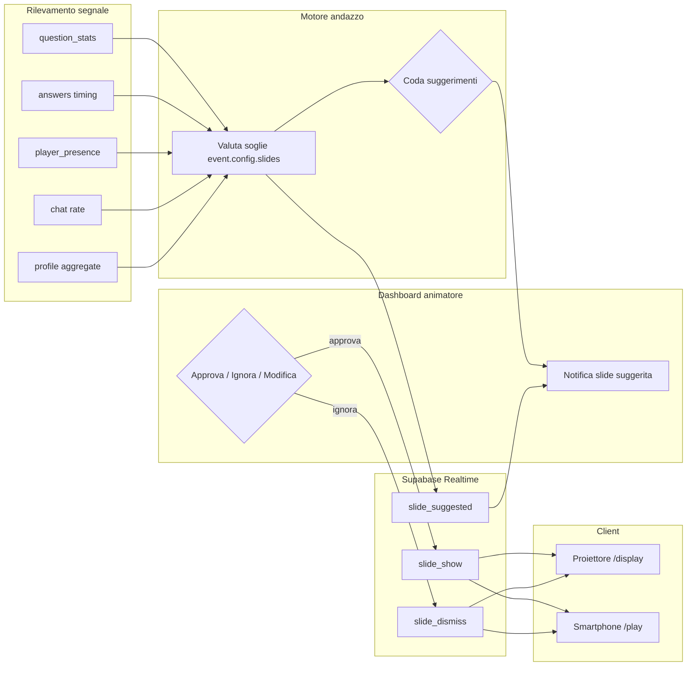
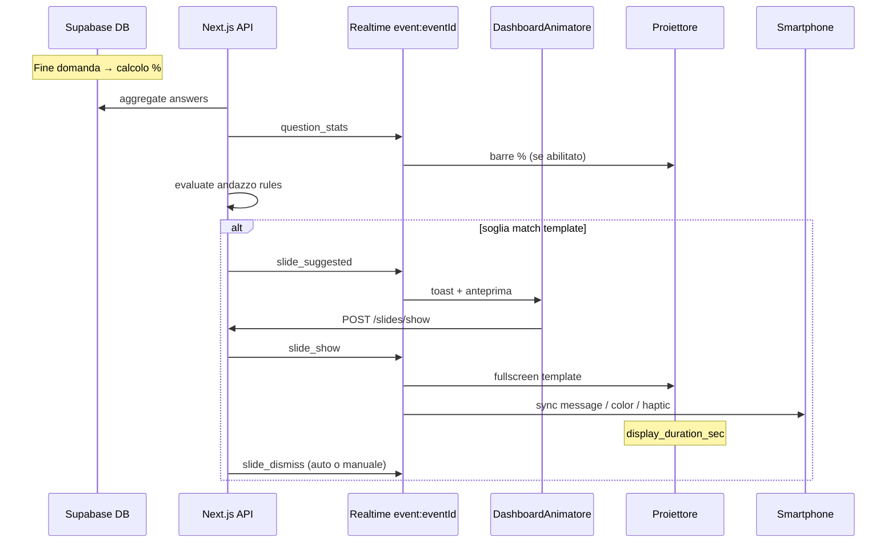

# Love Roulette — Libreria Slide Dinamiche

> Modulo 12 · Template slide reattive all'andazzo serata  
> Versione: 1.0 · Giugno 2026

## 1. Scopo

La **libreria slide dinamiche** traduce i segnali dell'**andazzo serata** (comportamento collettivo, statistiche quiz, ritmo risposte, profili emergenti) in messaggi fullscreen per proiettore e feedback leggero sui smartphone.

L'animatore resta **sempre in controllo**: il sistema **suggerisce** una slide; solo dopo approvazione (o auto-play se configurato) la slide va in onda.

---

## 2. Segnali andazzo serata

| Segnale | Fonte dati | Esempio soglia |
|---------|------------|----------------|
| `consensus_high` | `question_stats.percentages[]` | max opzione ≥ 70% |
| `consensus_split` | `question_stats.percentages[]` | top 2 opzioni entro ±5% (≈ 50/50) |
| `response_fast` | `answers.answered_at` delta | mediana < 8 s su ultima domanda |
| `response_slow` | idem | mediana > 25 s |
| `spicy_unlock` | branching + categoria `intimacy` | ≥ 60% ha attivato ramo spicy |
| `questions_to_matching` | `question_show.index` | index ≥ total − 5 |
| `profile_romantica` | aggregato categoria `romantic` | ≥ 65% risposte romantiche |
| `profile_avventura` | categoria `adventure` | ≥ 65% |
| `profile_party` | categoria `lifestyle` opzione party | ≥ 60% |
| `online_surge` | `player_presence.onlineCount` | +20% in 2 min |
| `chat_energy` | `chat_messages` rate | > 15 msg/min |
| `quiz_completion_wave` | players con quiz completo | ≥ 80% online |
| `vote_tie` | `vote_count_update.counts[]` | top 2 coppie entro 2 voti |
| `finalist_hype` | fase `finals` + chat keywords | sentiment positivo spike |
| `animator_manual` | dashboard | tap su template o testo libero |

---

## 3. Flusso integrazione



### Sequence — dalla statistica alla slide



---

## 4. Integrazione Realtime

Canale esistente: `event:{eventId}` — vedi [03-architecture.md](03-architecture.md) §5.

### 4.1 Eventi esistenti riusati

| Evento | Ruolo nel motore slide |
|--------|------------------------|
| `question_stats` | Trigger `stats_reaction`, calcolo consensus |
| `question_show` | Trigger countdown verso matching |
| `player_presence` | Trigger gamification presenza |
| `vote_count_update` | Trigger suspense / pareggio |
| `chat_highlight` | Pattern per slide testo utente (animator_custom) |
| `state_changed` | Disabilita slide fuori fase (es. no wildcard in WINNER) |

### 4.2 Eventi nuovi (M2)

| Evento | Payload | Mittente | Destinatari |
|--------|---------|----------|-------------|
| `slide_suggested` | `{ templateId, title, trigger, confidence, previewUrl? }` | Server | Admin |
| `slide_show` | `{ slideId, templateId, title, body, layout, mood, durationSec, mobileBehavior }` | Admin/Server | Display + Players |
| `slide_dismiss` | `{ slideId, reason: 'timeout' \| 'manual' \| 'phase_change' }` | Server | Display + Players |

### 4.3 Config evento

```json
{
  "slides": {
    "enabled": true,
    "auto_suggest": true,
    "auto_play": false,
    "cooldown_sec": 45,
    "max_per_phase": { "quiz": 8, "extraction": 4, "finals": 3 },
    "disabled_categories": []
  }
}
```

### 4.4 Endpoint API (proposti)

| Method | Endpoint | Descrizione |
|--------|----------|-------------|
| GET | `/api/events/[code]/slides/templates` | Lista template abilitati |
| POST | `/api/events/[code]/slides/show` | Animatore manda slide (templateId + override opz.) |
| POST | `/api/events/[code]/slides/dismiss` | Chiude slide corrente |
| GET | `/api/events/[code]/slides/suggestions` | Coda suggerimenti pending |

---

## 5. Schema template

Ogni voce della libreria segue questo schema:

| Campo | Tipo | Descrizione |
|-------|------|-------------|
| `id` | string | Identificativo stabile |
| `category` | enum | Una delle 6 categorie |
| `title` | string | Titolo proiettore (H1) |
| `body` | string | Corpo slide (supporta `{placeholder}`) |
| `trigger` | object | Condizione andazzo |
| `display_duration_sec` | number | Durata default fullscreen |
| `projector_layout` | string | Hint layout display |
| `mobile_behavior` | enum | `sync_message` \| `color_only` \| `haptic` |
| `mood` | string | Associazione mood / tema consigliato |

**Placeholder comuni**: `{pct}`, `{option_label}`, `{online_count}`, `{questions_left}`, `{profile_label}`, `{top_nick}`.

---

## 6. Libreria template (18)

### 6.1 `stats_reaction` — Reazioni alle statistiche live

#### `sr_consensus_wave`

| Campo | Valore |
|-------|--------|
| **id** | `sr_consensus_wave` |
| **title** | Siamo tutti d'accordo! |
| **body** | Il **{pct}%** di voi ha scelto «{option_label}». Questa sala ha un'opinione chiara! |
| **trigger** | `consensus_high` ≥ 70% su domanda appena chiusa |
| **display_duration_sec** | 8 |
| **projector_layout** | `stats_hero` — barra % gigante centrata, opzione vincente evidenziata, logo angolo |
| **mobile_behavior** | `sync_message` |
| **mood** | `energia` — tema Dark Fuchsia / Neon Party |

#### `sr_split_debate`

| Campo | Valore |
|-------|--------|
| **id** | `sr_split_debate` |
| **title** | Sala divisa! |
| **body** | **50/50** (circa): metà di voi «{option_a}», metà «{option_b}». Chi convince l'altra metà stasera? |
| **trigger** | `consensus_split` — top 2 opzioni 45–55% ciascuna |
| **display_duration_sec** | 10 |
| **projector_layout** | `split_screen` — due colonne 50%, barre animate speculari |
| **mobile_behavior** | `color_only` — bordo accent del colore della propria risposta |
| **mood** | `tensione_giocoso` |

#### `sr_minority_pride`

| Campo | Valore |
|-------|--------|
| **id** | `sr_minority_pride` |
| **title** | Team coraggioso |
| **body** | Solo il **{pct}%** ha risposto come voi. Le minoranze spesso fanno scintille ✨ |
| **trigger** | opzione scelta da ≤ 15% dei rispondenti, almeno 20 risposte |
| **display_duration_sec** | 7 |
| **projector_layout** | `badge_corner` — testo centrale + badge percentuale piccolo |
| **mobile_behavior** | `sync_message` — solo per chi è in minoranza |
| **mood** | `complicità` |

#### `sr_stat_reveal`

| Campo | Valore |
|-------|--------|
| **id** | `sr_stat_reveal` |
| **title** | Ecco la verità |
| **body** | Domanda chiusa. In questa sala: **{pct_a}%** · **{pct_b}%** · **{pct_c}%** · **{pct_d}%** |
| **trigger** | `question_stats` broadcast + `events.config.stats_visibility.projector = true` |
| **display_duration_sec** | 12 |
| **projector_layout** | `four_bars` — 4 barre orizzontali animate (design system §4.2) |
| **mobile_behavior** | `color_only` |
| **mood** | `neutro_informativo` |

---

### 6.2 `mood_shift` — Cambio atmosfera guidato

#### `ms_romantica_emerge`

| Campo | Valore |
|-------|--------|
| **id** | `ms_romantica_emerge` |
| **title** | Anima romantica |
| **body** | Profilo emergente: **Romantica**. Candele, sguardi, e forse qualche goosebump stasera… |
| **trigger** | `profile_romantica` ≥ 65% su prime 10+ domande con categoria `romantic` |
| **display_duration_sec** | 9 |
| **projector_layout** | `mood_fullscreen` — sfondo gradient Romantic Elegant, serif titolo |
| **mobile_behavior** | `sync_message` |
| **mood** | `romantico` — tema `romantic_elegant` |

#### `ms_avventura_rise`

| Campo | Valore |
|-------|--------|
| **id** | `ms_avventura_rise` |
| **title** | Spirito avventuroso |
| **body** | Questa sala urla **avventura**! Adrenalina, viaggi, e zero noia. |
| **trigger** | `profile_avventura` ≥ 65% su domande `adventure` |
| **display_duration_sec** | 8 |
| **projector_layout** | `mood_fullscreen` — accent arancio/ cyan, motion leggero diagonale |
| **mobile_behavior** | `haptic` — pulse breve |
| **mood** | `avventura` — Neon Party |

#### `ms_spicy_unlock`

| Campo | Valore |
|-------|--------|
| **id** | `ms_spicy_unlock` |
| **title** | Livello spicy sbloccato 🌶️ |
| **body** | Oltre il **60%** ha scelto il ramo «piccante». La serata si scalda — con classe! |
| **trigger** | `spicy_unlock` — branching verso domande `intimacy`, ≥ 60% percorsi attivati |
| **display_duration_sec** | 10 |
| **projector_layout** | `pulse_accent` — bordo accent pulsante, icona peperoncino stilizzato |
| **mobile_behavior** | `sync_message` + `haptic` |
| **mood** | `piccante_ironico` — Dark Fuchsia, mai esplicito |

#### `ms_party_mode`

| Campo | Valore |
|-------|--------|
| **id** | `ms_party_mode` |
| **title** | Modalità party ON |
| **body** | Disco, musica, energia: **{pct}%** vive per la pista. Animatore, alza il volume! |
| **trigger** | `profile_party` ≥ 60% su opzioni lifestyle «party/discoteca» |
| **display_duration_sec** | 8 |
| **projector_layout** | `neon_burst` — glow neon, titolo grande |
| **mobile_behavior** | `haptic` |
| **mood** | `festa` — Neon Party |

---

### 6.3 `countdown` — Ritmo e attesa

#### `cd_matching_soon`

| Campo | Valore |
|-------|--------|
| **id** | `cd_matching_soon` |
| **title** | Quasi match! |
| **body** | Ancora **{questions_left}** domande al matching. Preparate il cuore. |
| **trigger** | `questions_to_matching` — `index >= total - 5` |
| **display_duration_sec** | 6 |
| **projector_layout** | `countdown_ring` — anello progress + numero grande |
| **mobile_behavior** | `sync_message` |
| **mood** | `anticipazione` |

#### `cd_fast_answers`

| Campo | Valore |
|-------|--------|
| **id** | `cd_fast_answers` |
| **title** | Reflex pazzeschi |
| **body** | Ultima domanda chiusa in **{median_sec}s** di media. Questa sala non ci pensa due volte! |
| **trigger** | `response_fast` — mediana risposte ultima domanda < 8 s |
| **display_duration_sec** | 7 |
| **projector_layout** | `speed_lines` — titolo con motion blur leggero |
| **mobile_behavior** | `haptic` — doppio tap breve |
| **mood** | `iperattivo` |

#### `cd_slow_thinkers`

| Campo | Valore |
|-------|--------|
| **id** | `cd_slow_thinkers` |
| **title** | Pensatori profondi |
| **body** | **{median_sec}s** di media sull'ultima domanda. Nessuna risposta affrettata — rispetto. |
| **trigger** | `response_slow` — mediana > 25 s |
| **display_duration_sec** | 7 |
| **projector_layout** | `calm_center` — testo lento fade-in, sfondo scuro |
| **mobile_behavior** | `color_only` |
| **mood** | `riflessivo` — Romantic Elegant |

---

### 6.4 `gamification` — Engagement e progresso

#### `gm_online_surge`

| Campo | Valore |
|-------|--------|
| **id** | `gm_online_surge` |
| **title** | Sala in crescita! |
| **body** | **{online_count}** single connessi adesso. L'energia sale! |
| **trigger** | `online_surge` — +20% `player_presence` in 120 s |
| **display_duration_sec** | 6 |
| **projector_layout** | `counter_hero` — numero animato count-up |
| **mobile_behavior** | `sync_message` |
| **mood** | `hype` |

#### `gm_quiz_wave`

| Campo | Valore |
|-------|--------|
| **id** | `gm_quiz_wave` |
| **title** | Ondata di risposte |
| **body** | **{completion_pct}%** ha completato il quiz. Chi manca, ultimo giro! |
| **trigger** | `quiz_completion_wave` ≥ 80% giocatori online |
| **display_duration_sec** | 8 |
| **projector_layout** | `progress_wave` — barra progresso fullscreen |
| **mobile_behavior** | `sync_message` — solo per chi non ha finito |
| **mood** | `spinta` |

#### `gm_vote_nail_biter`

| Campo | Valore |
|-------|--------|
| **id** | `gm_vote_nail_biter` |
| **title** | Voto serrato! |
| **body** | Pareggio in testa. Ogni voto conta — **3, 2, 1…** |
| **trigger** | `vote_tie` su `vote_count_update` in fase `finals` |
| **display_duration_sec** | 5 |
| **projector_layout** | `vote_split` — tre colonne coppie, highlight pari |
| **mobile_behavior** | `haptic` |
| **mood** | `suspense` |

#### `gm_streak_match`

| Campo | Valore |
|-------|--------|
| **id** | `gm_streak_match` |
| **title** | Tre volte uguale! |
| **body** | **{pct}%** ha risposto uguale per **3 domande di fila**. Telepatia di sala? |
| **trigger** | 3 domande consecutive con stesso `consensus_high` ≥ 65% |
| **display_duration_sec** | 9 |
| **projector_layout** | `streak_badges` — tre badge sovrapposti con check |
| **mobile_behavior** | `sync_message` |
| **mood** | `meraviglia` |

---

### 6.5 `animator_custom` — Controllo animatore

#### `ac_custom_message`

| Campo | Valore |
|-------|--------|
| **id** | `ac_custom_message` |
| **title** | *(libero animatore)* |
| **body** | *(testo libero, max 280 caratteri)* |
| **trigger** | `animator_manual` — tap «Slide personalizzata» in dashboard |
| **display_duration_sec** | 15 (regolabile 5–60) |
| **projector_layout** | `plain_hero` — titolo + body centrati, watermark logo |
| **mobile_behavior** | `sync_message` |
| **mood** | `neutro` — eredita tema evento |

#### `ac_chat_spotlight`

| Campo | Valore |
|-------|--------|
| **id** | `ac_chat_spotlight` |
| **title** | Messaggio dalla sala |
| **body** | «{chat_body}» — {nick_or_anonimo} |
| **trigger** | `animator_manual` su messaggio chat (estende `chat_highlight`) |
| **display_duration_sec** | 12 |
| **projector_layout** | `quote_card` — virgolette grandi, nick piccolo sotto |
| **mobile_behavior** | `color_only` |
| **mood** | `calore` — Romantic Elegant |

#### `ac_phase_announce`

| Campo | Valore |
|-------|--------|
| **id** | `ac_phase_announce` |
| **title** | {phase_label} |
| **body** | {phase_script} — es. «Inizia l'estrazione coppie!» |
| **trigger** | `animator_manual` o auto su `state_changed` se `slides.auto_phase = true` |
| **display_duration_sec** | 10 |
| **projector_layout** | `phase_banner` — fascia fase in header + messaggio centrale |
| **mobile_behavior** | `sync_message` |
| **mood** | `cerimoniale` |

---

### 6.6 `wildcard_fun` — Sorprese e ironia

#### `wf_plot_twist`

| Campo | Valore |
|-------|--------|
| **id** | `wf_plot_twist` |
| **title** | Plot twist! |
| **body** | L'animatore non se l'aspettava: **{pct}%** ha risposto l'opposto della domanda precedente. Incostanti? O liberi? |
| **trigger** | correlazione negativa > 0.6 tra due domande consecutive (anti-allineamento) |
| **display_duration_sec** | 9 |
| **projector_layout** | `glitch_text` — titolo con micro-glitch 300ms |
| **mobile_behavior** | `haptic` |
| **mood** | `caos_giocoso` |

#### `wf_single_rebel`

| Campo | Valore |
|-------|--------|
| **id** | `wf_single_rebel` |
| **title** | Uno contro tutti |
| **body** | Un solo giocatore ha scelto diversamente da **{pct}%** della sala. Chi è il ribelle? *(nick non rivelato)* |
| **trigger** | esattamente 1 risposta diversa su ≥ 25 rispondenti, consensus ≥ 90% |
| **display_duration_sec** | 8 |
| **projector_layout** | `spotlight_solo` — alone centrale, testo misterioso |
| **mobile_behavior** | `haptic` — solo per il ribelle |
| **mood** | `mistero` |

#### `wf_love_roulette_wink`

| Campo | Valore |
|-------|--------|
| **id** | `wf_love_roulette_wink` |
| **title** | La ruota decide |
| **body** | Statistiche? Numeri? Poi arriva Love Roulette e cambia tutto. Tenetevi forte. |
| **trigger** | transizione `quiz → matching` (wildcard automatica una sola volta) |
| **display_duration_sec** | 7 |
| **projector_layout** | `roulette_tease` — cuori orbitanti, no reveal coppie |
| **mobile_behavior** | `sync_message` |
| **mood** | `suspense_brand` |

#### `wf_confetti_random`

| Campo | Valore |
|-------|--------|
| **id** | `wf_confetti_random` |
| **title** | Momento random! |
| **body** | Nessun motivo. Solo perché stasera siete fantastici. 🎉 |
| **trigger** | cooldown rispettato + random 1/20 a fine domanda in fase `quiz` |
| **display_duration_sec** | 5 |
| **projector_layout** | `confetti_burst` — canvas-confetti (design system §5.4 leggero) |
| **mobile_behavior** | `haptic` |
| **mood** | `celebrazione` |

---

## 7. Comportamento mobile per tipo

| `mobile_behavior` | Cosa vede il giocatore |
|-------------------|------------------------|
| `sync_message` | Banner compatto con titolo slide (non fullscreen), sotto header |
| `color_only` | Schermo invariato; bordo/status bar tint `accent-primary` 3 s |
| `haptic` | Vibrazione leggera (200 ms) se permesso; nessun testo extra |

Tutti i client ricevono `slide_show` via Realtime; il componente mobile filtra per `mobileBehavior`.

---

## 8. Regole anti-spam

1. **Cooldown globale**: min 45 s tra due `slide_show` (config `cooldown_sec`).
2. **Max per fase**: vedi `max_per_phase` in config.
3. **Priorità**: `animator_custom` > `countdown` (fase critica) > `stats_reaction` > `wildcard_fun`.
4. **Coda**: max 3 suggerimenti pending; i più vecchi scadono dopo 90 s.
5. **Fasi bloccate**: nessun `wildcard_fun` durante `winner` o `closed`.

---

## 9. Layout proiettore — riferimento rapido

| Hint | Uso |
|------|-----|
| `stats_hero` | Statistiche dominanti, area principale §4.2 design system |
| `split_screen` | Confronto 50/50 |
| `four_bars` | Barre % animate post-domanda |
| `mood_fullscreen` | Cambio atmosfera tematica |
| `countdown_ring` | Progress verso milestone |
| `plain_hero` | Testo libero animatore |
| `quote_card` | Citazione chat |
| `confetti_burst` | Momento celebrativo breve |

Safe zone 5%, font minimo 32px body / 64px titolo — vedi [02-design-system.md](02-design-system.md).

---

## 10. Riepilogo template

| Categoria | Count | ID |
|-----------|------:|-----|
| `stats_reaction` | 4 | sr_consensus_wave, sr_split_debate, sr_minority_pride, sr_stat_reveal |
| `mood_shift` | 4 | ms_romantica_emerge, ms_avventura_rise, ms_spicy_unlock, ms_party_mode |
| `countdown` | 3 | cd_matching_soon, cd_fast_answers, cd_slow_thinkers |
| `gamification` | 4 | gm_online_surge, gm_quiz_wave, gm_vote_nail_biter, gm_streak_match |
| `animator_custom` | 3 | ac_custom_message, ac_chat_spotlight, ac_phase_announce |
| `wildcard_fun` | 4 | wf_plot_twist, wf_single_rebel, wf_love_roulette_wink, wf_confetti_random |
| **Totale** | **22** | |

---

## 11. Riferimenti

- Realtime e canali → [03-architecture.md](03-architecture.md) §5
- Stats live e visibilità → [04-features.md](04-features.md) §2.5
- Display e animazioni → [02-design-system.md](02-design-system.md) §4–5
- Categorie domande / profili → [06-question-bank.md](06-question-bank.md) §2
- Operatività animatore → [07-animator-runbook.md](07-animator-runbook.md)
