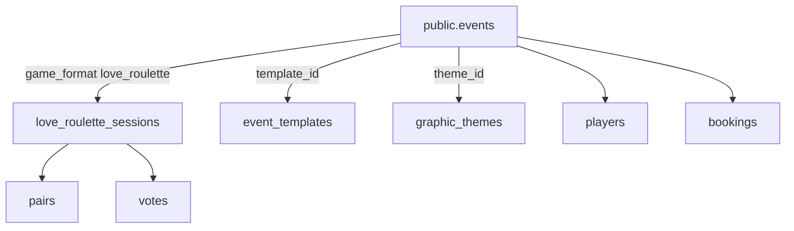

# Handoff Love Roulette ↔ MusicPro Eventi (APP GAS)

> **Documento-ponte** tra workspace Cursor  
> Love Game: `/Users/mauroandreoni/Love Game`  
> GAS: `/Users/mauroandreoni/APP Eventi da GAS/musicpro-eventi-app`  
> Aggiornato: 2026-06-19

## Come lavorare in parallelo (2 sessioni Cursor)

Non esiste sync automatico tra chat Cursor. Il flusso operativo:

1. **Questo file** è la fonte di verità per convergenza (aggiornare entrambi i repo quando cambia).
2. Copia spec Love Roulette in GAS: `docs/LOVE_ROULETTE_INTEGRATION.md` (mirror).
3. Ogni modifica schema → **solo** in `musicpro-eventi-app/supabase/migrations/` + aggiornare `docs/SCHEMA_SOURCE_OF_TRUTH.md`.
4. Love Game `web/` punta allo **stesso** Supabase Pro: project `fvxdghqpavdcohczrvsc`.

### Checklist sessione GAS (incolla nel chat GAS)

```
Leggi:
- APP Eventi da GAS/docs/LOVE_ROULETTE_INTEGRATION.md
- Love Game/docs/13-platform-convergence-handoff.md (sync)

Task convergenza:
1. Migration game_format enum + colonna events.game_format
2. Tabelle modulo love_roulette (pairs, votes, question_pool, …) — vedi Love Game/docs/11-db-schema-adaptive.md
3. RPC get_animator_event_detail: esporre game_format
4. Admin: selezione game_format su evento (love_roulette | cervellone)
5. Non duplicare tabella events in Love Game — FK session → events.id
```

### Checklist sessione Love Game

```
Leggi:
- docs/13-platform-convergence-handoff.md
- GAS docs/SCHEMA_SOURCE_OF_TRUTH.md

Task:
1. .env.local → credenziali fvxdghqpavdcohczrvsc
2. Rimuovere/deprecare web/supabase/migrations standalone — usare migrations GAS
3. Adattare tipi a public.events MusicPro (non events.code 6 char — usare events.id + join_code in metadata o nuova colonna)
4. Integrare graphic_themes per temi UI Love Roulette
5. PIN animatore: allineare a staff_users / staff auth esistente OPPURE events.metadata.admin_pin
```

---

## Supabase condiviso

| Item | Valore |
|------|--------|
| Project ID | `fvxdghqpavdcohczrvsc` |
| Nome | MusicProEventi |
| Piano | Pro (condiviso) |
| Migrations canonici | `musicpro-eventi-app/supabase/migrations/` |

### Modello convergenza (approvato)

**Un database, tabelle core condivise, modulo Love Roulette aggiuntivo.**



### `events` MusicPro (esistente) — NON duplicare

Colonne chiave già presenti: `id`, `template_id`, `theme_id`, `venue_id`, `status`, `metadata`, `event_date`, …

**Da aggiungere (migration GAS):**

```sql
CREATE TYPE public.event_game_format AS ENUM (
  'cervellone',
  'love_roulette'
);

ALTER TABLE public.events
  ADD COLUMN game_format public.event_game_format NOT NULL DEFAULT 'cervellone';

CREATE INDEX events_game_format_idx ON public.events (game_format);
```

**Join code serata** (URL `/s/ABC123`):

Opzione A — `events.metadata->>'love_roulette_code'` (quick)  
Opzione B — colonna `events.live_session_code text UNIQUE` (production)

### Tabelle Love Roulette (nuove, prefisso consigliato)

Evitare conflitto con `players` MusicPro — valutare:

| Love Game doc | MusicPro esistente | Proposta |
|---------------|-------------------|----------|
| `players` | `players` già esiste | **Estendere** `players` con colonne LR in metadata OPPURE `love_roulette_participants` FK player_id |
| `events` | `events` | **Riutilizzare** + `game_format` |
| `pairs`, `votes`, `question_pool` | — | Nuove tabelle |

Vedi dettaglio: [11-db-schema-adaptive.md](11-db-schema-adaptive.md) — adattare nomi in migration GAS.

---

## Frontend: dove vive Love Roulette

**Decisione (2026-06-19):** repo **separato** (`Love Game/web`) per ora; convergenza futura in monorepo GAS non esclusa.

| Fase | Scelta |
|------|--------|
| **Ora** | `Love Game/web` → stesso Supabase `fvxdghqpavdcohczrvsc` |
| **Futuro** | `musicpro-eventi-app/apps/love-roulette/` al cutover unificato |

| Opzione | Pro | Contro |
|---------|-----|--------|
| **A) Monorepo GAS** | Shared package, deploy unico | Integrazione più tardiva |
| **B) Repo separato** ✅ **attuale** | Autonomia, già scaffoldato | Env/deploy temporaneamente duplicati |
| **C) Route in apps/web** | Stesso dominio | Accoppiamento forte |

---

## Auth & animatore

Decisioni Love Game review:
- Animatore v1: **solo PIN** (no Supabase auth separato)
- GAS ha già: `staff_users`, RPC animator auth, mobile staff app

**Convergenza:** PIN Love Roulette = stesso flusso staff GAS dove possibile, oppure `events.metadata->>'animator_pin'` per serata LR-only.

---

## Grafiche condivise

MusicPro ha già:
- `graphic_themes` (tematiche grafiche evento)
- Pipeline admin grafiche (PSD, poster, email)
- `events.theme_id` → tematica

Love Roulette **3 temi UI** (Dark Fuchsia, Romantic, Neon) dovrebbero:
1. Mappare a righe `graphic_themes` dedicate, OPPURE
2. Estendere `graphic_themes.metadata` con token CSS Love Roulette

Vedi [14-visual-quality-roadmap.md](14-visual-quality-roadmap.md).

---

## Stato sync

| Task | Love Game | GAS | Stato |
|------|-----------|-----|-------|
| Handoff doc | ✅ | ✅ mirror | OK |
| game_format migration | — | ✅ `20260624160000` | OK |
| Schema LR tables | doc | ✅ cloud | OK |
| Web adattato a MusicPro schema | ✅ | — | OK |
| Realtime session (polling fallback) | ✅ | — | OK |
| Quiz API questions/answers | ✅ | — | OK (pool blocker task 9) |
| Seed DEMO01 + doc setup | ✅ | — | OK |
| GAS checklist | ✅ | ⏳ task 5–10 | Vedi GAS_TEAM_CHECKLIST.md |

---

## Riferimenti

- Love Game master: [00-master-spec-v2.md](00-master-spec-v2.md)
- Adaptive engine: [10-adaptive-questions-mobile.md](10-adaptive-questions-mobile.md)
- DB adaptive: [11-db-schema-adaptive.md](11-db-schema-adaptive.md)
- GAS schema: `../APP Eventi da GAS/musicpro-eventi-app/docs/SCHEMA_SOURCE_OF_TRUTH.md`
