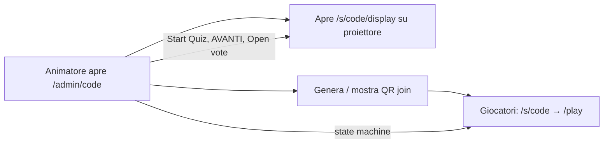

# Love Roulette — Production Entry Flow

> Modulo 16 · Perché esiste `/`, URL di produzione, gap M1  
> Versione: 1.0 · Giugno 2026

## 1. Domanda

In produzione non serve una home “dispatcher” con pulsanti demo. L’animatore deve aprire la **dashboard** come unico punto di controllo; il **proiettore** e i **telefoni** seguono URL dedicati. Perché oggi esiste `/` con tre link DEMO01?

---

## 2. Perché `/` esiste oggi (M1 dev scaffold)

La route `web/src/app/page.tsx` è un **hub di sviluppo**, non un entry point di prodotto.

| Elemento | Stato attuale |
|----------|---------------|
| Titolo card | “Demo serata” |
| Sottotitolo | “Prototipo UI — stesso Supabase MusicPro in convergenza” |
| Azioni | Link fissi a `DEMO01`: player, display, admin |
| Auth / evento | Nessuno — shortcut per chi sviluppa in locale |

È stato introdotto in **M1** per:

1. **Navigare rapidamente** tra le tre superfici (player, display, admin) senza ricordare URL o codici evento.
2. **Smoke-test** del prototipo UI su un evento seed (`DEMO01`).
3. **Convergenza MusicPro** — stesso backend, route Love Roulette ancora parziali.

La spec operativa ([07-animator-runbook.md](07-animator-runbook.md)) **non** menziona `/`. La timeline pre-serata parte da:

- T-60 min: aprire `/admin/{code}` e testare display
- 20:00: mostrare **QR evento** sul proiettore

Il game design ([01-game-design.md](01-game-design.md)) posiziona l’**animatore al centro** della state machine; i giocatori arrivano via URL evento / QR, non da una landing generica.

**Conclusione:** `/` è scaffolding da rimuovere o nascondere in produzione.

### Implementazione (giugno 2026)

| File | Comportamento |
|------|---------------|
| `web/src/lib/env.ts` | `isProductionApp()` → `NODE_ENV === "production"` |
| `web/src/app/page.tsx` | Se produzione: `notFound()` (404 Next.js). Altrimenti hub dev con link DEMO01 |

In produzione `/` risponde **404** — nessuna card “Demo serata”, nessun link hardcoded. In locale (`next dev`) l’hub resta disponibile per smoke-test.

Test: `web/src/lib/env.test.ts`, `web/src/app/page.test.tsx`.

---

## 3. URL di produzione (target)

Tre dispositivi, tre route. Nessun “quarto schermo” dispatcher.

| Ruolo | Dispositivo | URL | Note |
|-------|-------------|-----|------|
| **Animatore (admin)** | Tablet / PC | `/admin/{code}` | Control center: avvio fasi, QR, presenze, AVANTI, voti. Accesso protetto (PIN / staff auth — da implementare). |
| **Display sala** | Proiettore / TV esterno | `/s/{code}/display` | Fullscreen (F11). Riceve push realtime: QR lobby, roulette, coppie, finali, vincitore. |
| **Giocatore** | Smartphone | `/s/{code}/play` | Sessione di gioco dopo join (quiz, attesa, voto). |
| **Join / pre-reg** | Smartphone (ingresso) | `/s/{code}` o `/register/{code}` | Landing pre-quiz: login, badge, link verso `/play`. Il QR in sala punta qui o direttamente a `/play` se già autenticato. |

`{code}` = slug evento (es. `DEMO01`, codice serata cliente). Normalizzato uppercase in UI admin.

### Flusso serata (semplificato)

1. **Setup (T-60):** animatore → `/admin/{code}`; tecnico → `/s/{code}/display` fullscreen.
2. **Apertura sala:** dashboard (o display in LOBBY) mostra QR verso join player; badge fisici opzionali (M2).
3. **Durante il gioco:** ogni transizione di fase parte dalla dashboard e si propaga a display + telefoni via realtime/API.
4. **Fine:** `Close Event` da dashboard; display e player mostrano stato `CLOSED`.

---

## 4. Raccomandazioni per produzione

### 4.1 Home `/`

| Opzione | Quando usarla |
|---------|----------------|
| **404 in produzione** (`isProductionApp()` → `notFound()`) | ✅ Implementato — deploy pulito; nessuna superficie extra |
| **Solo dev** (hub visibile quando `NODE_ENV !== 'production'`) | ✅ Implementato — shortcut locale per il team |
| **Redirect a marketing** (sito vetrina separato) | Se serve landing pubblica brand, non dispatcher tecnico |

Non esporre in produzione la card “Demo serata” con link hardcoded a `DEMO01`.

### 4.2 Dashboard come unico control center

La dashboard `/admin/{code}` deve essere l’**unico** posto da cui l’animatore:

- avvia e avanza la state machine (`LOBBY` → … → `CLOSED`);
- genera e mostra il QR (copia link + “push to display”);
- apre / verifica il display (`/s/{code}/display` in nuova tab);
- monitora presenze, quiz %, coppie, voti;
- gestisce eccezioni (spareggio, reset fase, moderazione — M2+).

Il display **non** si configura da solo: riflette ciò che la dashboard (o il backend su suo comando) pubblica.

### 4.3 QR

- **Generazione:** in LOBBY, dashboard mostra QR (URL join) + pulsante “Mostra su proiettore”.
- **Target QR:** `https://{host}/s/{code}` (join) con redirect a `/play` post-login; oppure deep link `/s/{code}?badge={code}` (M2).
- **Display in LOBBY:** schermata QR full-bleed ([04-features.md](04-features.md) §7 — “QR evento in lobby”, M1).

---

## 5. Gap dashboard M1 vs spec

Implementazione attuale: `web/src/app/admin/[eventCode]/page.tsx`.

È un **mock UI locale**: stato fase in `useState`, contatori fissi a `0`, nessuna chiamata API/Supabase Realtime.

| Area | Spec (M1) | Stato M1 attuale |
|------|-----------|------------------|
| **State machine** | Persistita su evento; transizioni server-side; sync display + player | Solo stato React locale; refresh = reset |
| **Start Quiz** | Trigger `start_quiz`; player ricevono domande; display opzionale stats | Bottone cambia label locale, nessun push |
| **QR evento** | Dashboard genera QR; display LOBBY mostra QR | Assente |
| **Presenze** | Lista online, badge, quiz completati | `onlineCount = 0`, `quizProgress = 0` hardcoded |
| **AVANTI / estrazione** | Estrae coppia, animazione roulette su display | Bottone senza handler; display non aggiornato |
| **Modalità estrazione** | random / classifica / ibrido in `events.config` | Select UI only, non salvata |
| **Sfoltimento / finali** | Ruoli player (`finalist` / `audience`), open/close vote | Bottoni navigano fasi locali |
| **Votazione** | `open_voting` / `close_voting` realtime | “Apri voto” senza backend |
| **Proiettore** | Push slide per fase (QR, roulette, reveal, vincitore) | Link “Apri display” apre tab; nessun comando push |
| **Auth animatore** | Login staff / PIN per evento | Route aperta |
| **Timeline / contatori** | §6.1 features: panoramica fase + metriche live | Sidebar fasi visiva ok; dati non collegati |
| **Rehearsal** | M3 | Non presente |
| **Chat / moderazione** | M2 | Non presente |

### Cosa funziona già (altre route)

- `/s/{code}` — join evento con risoluzione slug Supabase/MusicPro.
- `/s/{code}/play` — UI player con hook sessione e componenti quiz/attesa.
- `/s/{code}/display` — superficie proiettore (da collegare a comandi dashboard).
- API parziali sotto `/api/events/[code]/…` (domande, risposte).

Il pezzo mancante principale è il **collegamento dashboard → backend → realtime → display/play**, non nuove pagine entry.

---

## 6. Checklist implementazione (post-doc)

Ordine suggerito per chiudere il gap entry flow:

1. [x] Nascondere o redirect `/` in production (`page.tsx` + `env.ts`).
2. [ ] PIN / auth su `/admin/{code}`.
3. [ ] Dashboard legge/scrive `events.state` e `events.config` via API.
4. [ ] Blocco LOBBY: generazione QR + azione “Mostra su display”.
5. [ ] Ogni controllo fase (Start Quiz, AVANTI, Open vote) → mutation server + broadcast Realtime.
6. [ ] Display sottoscritto a canale evento e renderizza slide per stato.
7. [ ] Player `/play` sottoscritto allo stesso stato (quiz, voto, attesa).

---

## 7. Riferimenti

- Game design & state machine → [01-game-design.md](01-game-design.md)
- Feature M1/M2 → [04-features.md](04-features.md) (§6 Dashboard, §7 Display)
- Runbook operativo → [07-animator-runbook.md](07-animator-runbook.md)
- Setup evento test → [15-test-event-setup.md](15-test-event-setup.md)
- Dev home (da deprecare in prod) → `web/src/app/page.tsx`
- Dashboard mock → `web/src/app/admin/[eventCode]/page.tsx`
