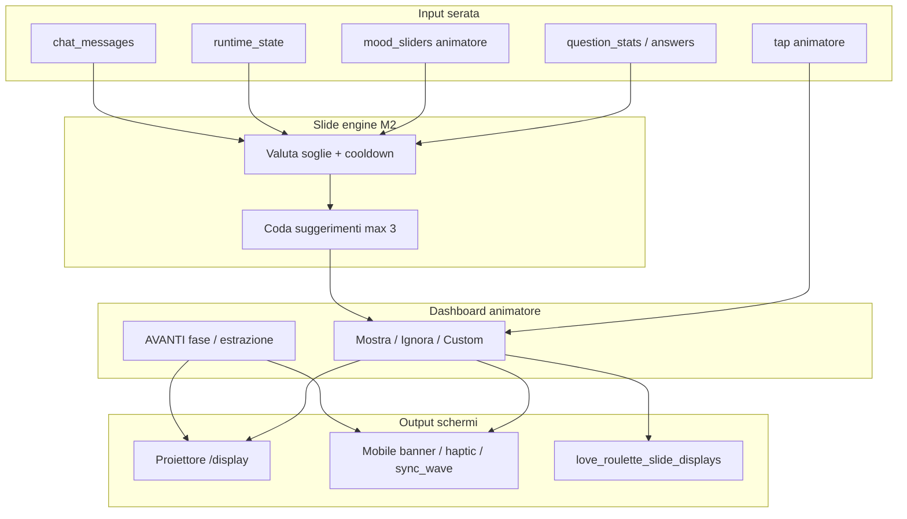

# Love Roulette — Regia Video Roadmap

> Modulo 17 · Proiettore, slide engine, sync mobile, asset video/reel  
> Versione: 1.0 · Giugno 2026

## Executive summary

**Regia video** è il sottosistema che permette all'animatore di **mandare contenuti sugli schermi** durante la serata: proiettore fullscreen (`/display`), feedback leggero sui telefoni, e (in futuro) slot per reel/video pre-renderizzati o stream OBS/vMix.

Oggi il proiettore è una **demo visiva** sincronizzata solo su `runtime_state`; il DB condiviso MusicPro ha già le tabelle `love_roulette_slide_*`, ma **nessun seed, API, motore o UI regia** le usa. Questo documento chiude il gap tra spec ([10](10-adaptive-questions-mobile.md), [12](12-slides-library.md), [04](04-features.md)) e implementazione `web/`.

---

## 1. Cosa significa «regia video» nello spec

### 1.1 Definizione operativa

| Concetto | Ruolo | Device | Spec di riferimento |
|----------|-------|--------|---------------------|
| **Display proiettore** | Schermo pubblico 16:9, font grandi, safe zone 5% | Browser fullscreen `/s/{code}/display` | [04-features.md §7](04-features.md), [02-design-system.md §4–5](02-design-system.md) |
| **Slide engine** | Motore che propone/mostra slide reattive all'**andazzo serata** (stats, ritmo, mood) | Server + dashboard conferma | [10 §6](10-adaptive-questions-mobile.md), [12](12-slides-library.md) |
| **Trigger animatore** | Ogni contenuto spettacolare passa da approvazione esplicita (principio *suggerisce → conferma*) | Dashboard `/admin/{code}` | [10 §1](10-adaptive-questions-mobile.md), [00-master-spec §4](00-master-spec-v2.md) |
| **Sync mobile** | Second screen: amplifica emozione, **non** duplica slide fullscreen del proiettore | `/s/{code}/play` | [10 §5](10-adaptive-questions-mobile.md) |
| **Asset video/reel** | Grafiche pre-render (locandine, intro, reel social), loop brand, o sorgente live esterna | Proiettore o OBS/vMix | [14-visual-quality-roadmap.md](14-visual-quality-roadmap.md), pipeline GAS `graphic_themes` |



### 1.2 Layer contenuto proiettore (priorità visual)

1. **Stato gioco** (M1) — lobby QR, quiz placeholder, roulette, reveal coppia, barra finalisti, prova corrente, countdown voto, vincitore.
2. **Slide dinamiche** (M2) — 18+ template andazzo ([12 §6](12-slides-library.md)): consensus, split, mood shift, countdown matching, gamification.
3. **Override manuali** (M2) — messaggio libero, spotlight chat, annuncio fase (`animator_custom`).
4. **Stats live** (M2) — barre % post-domanda se `stats_visibility.projector = true` ([04 §2.5](04-features.md)).
5. **Slot media** (M2+) — immagine/video full-bleed da URL (GAS Storage, CDN, o browser source OBS).

### 1.3 Regole proiettore vs mobile

| Regola | Proiettore | Mobile |
|--------|------------|--------|
| Slide andazzo | Fullscreen 4–8 s, skippabile | Solo `banner` / `color_only` / `haptic` — mai fullscreen slide andazzo |
| Domanda quiz attiva | Può sovrapporsi temporaneamente (stats bar) | Resta su UI quiz |
| Frequenza auto | Max 1 slide ogni 4 domande; cooldown 45 s | Segue `mobileBehavior` del template |
| Conferma | Default: suggerimento → [Mostra][Ignora] | Auto se slide approvata e `mobile_spectacle` abilitato |

Dettaglio eventi realtime: [12 §4](12-slides-library.md), [10 §5.2](10-adaptive-questions-mobile.md).

---

## 2. Stato attuale in `web/`

### 2.1 Cosa esiste (demo / fondamenta)

| Componente | Stato | Note |
|------------|-------|------|
| Route `/s/{code}/display` | ✅ Shell | Sottoscrive `runtime_state` via `useLoveRouletteSession`; UI placeholder per fase |
| Roulette Lottie | ✅ Prototipo | `LottieHeartsSpin` quando `runtime_state === 'matching'` |
| Route `/admin/{code}` | ⚠️ Mock locale | State React in-memory; **nessuna** chiamata API Supabase |
| Mobile `/play` | ⚠️ Demo spettacolo | Bottoni «Roulette» / «Estrazione» locali; `CoupleTakeover`, `AmbientBackground` |
| Realtime session | ⚠️ Parziale | `subscribeLoveRouletteSession` su `love_roulette_sessions`; fallback polling 5 s |
| API quiz | ✅ | `questions`, `answers` verso pool GAS |
| Temi UI | ⚠️ | `metadata.love_roulette.theme` + path verso `graphic_themes` ([GAS_TEAM_CHECKLIST §6](GAS_TEAM_CHECKLIST.md)) |

### 2.2 Cosa manca (regia completa)

| Capability spec | Implementato? |
|-----------------|:-------------:|
| Broadcast `question_show` → display mostra domanda/stats | ❌ |
| Broadcast `couple_revealed` / `next_couple_spin` | ❌ |
| Eventi `slide_suggested` / `slide_show` / `slide_dismiss` | ❌ |
| Pannello **Regia** in dashboard animatore | ❌ |
| Renderer template slide (layout `stats_hero`, `split_screen`, …) | ❌ |
| Motore andazzo + coda suggerimenti | ❌ |
| Log su `love_roulette_slide_displays` | ❌ |
| Slot video/reel / integrazione grafiche GAS | ❌ |
| Admin channel separato (`event:{id}:admin`) per leak prevention | ❌ |

### 2.3 Display attuale — limiti espliciti

Il file `web/src/app/s/[eventCode]/display/page.tsx` oggi:

- reagisce solo a `runtimeState` (8 stati enum);
- footer finalisti hardcoded («Coppia 1/2/3»);
- nessun listener su coppie, domande, slide, chat;
- nessuna coda visuale (una slide non può «interrompere» temporaneamente lo stato base).

**Conclusione:** adatto a **smoke test layout e tema**, non a regia live.

---

## 3. Gap vs spec e DB GAS

### 3.1 Schema già migrato (MusicPro)

Migration canonica: `musicpro-eventi-app/supabase/migrations/20260624160000_love_roulette_module.sql`

| Tabella | Scopo | Seed in migration? |
|---------|--------|:------------------:|
| `love_roulette_slide_templates` | Catalogo template (`slug`, `title`, `layout`, `payload` jsonb, `default_duration_ms`) | ❌ vuota |
| `love_roulette_slide_triggers` | Regole (`trigger_type`, `condition` jsonb, `priority`, `cooldown_slots`) | ❌ vuota |
| `love_roulette_slide_displays` | Audit slide mostrate per evento/sessione | ❌ (popolata solo a runtime) |

Enum `love_roulette_slide_trigger_type`: `mood_threshold`, `event_state`, `slot_milestone`, `answer_consensus`, `manual`, `spicy_unlock`.

Correlati alla regia (già presenti, non collegati all'UI):

- `love_roulette_sessions.runtime_state` — sync fase display ✅ parziale
- `love_roulette_session_slots` — coda domande (futuro overlay «domanda X di Y»)
- `love_roulette_mood_state` — slider mood + `last_slide_at` (anti-spam DB-side)

### 3.2 Mapping spec doc ↔ schema GAS

| Spec [12-slides-library](12-slides-library.md) | Schema GAS | Gap |
|--------------------------------------------------|------------|-----|
| 22 template con `id` stabile (`sr_consensus_wave`, …) | `slide_templates.slug` | Serve **seed migration** con payload layout + placeholder |
| `trigger` object per template | `slide_triggers.condition` jsonb | Serve motore che interpreta stesse chiavi di [12 §2](12-slides-library.md) |
| `slide_show` realtime payload | Non esiste colonna «live queue» | Stato live via **broadcast** Supabase; persistenza solo su `slide_displays` |
| Libreria [11-db-schema-adaptive](11-db-schema-adaptive.md) (`slide_templates` senza prefisso) | Prefisso `love_roulette_*` in GAS | Love Game deve usare **nomi GAS** (convergenza [13](13-platform-convergence-handoff.md)) |

### 3.3 Pipeline grafiche MusicPro (reel / locandine)

Separata dallo slide engine in-app:

- `graphic_themes` + `admin_send_event_graphics` — locandine email/WhatsApp ([14 §Integrazione GAS](14-visual-quality-roadmap.md))
- Asset statici (poster, story) ≠ **regia live** serata
- Convergenza futura: `metadata.ui_tokens` (Lottie URL, font proiettore) letti da `/display` al boot

**Blocker attuale per l'animatore:** senza regia in-app non può «mandare» né slide dinamiche né reel durante lo show — solo aprire manualmente file/video dal PC o OBS.

---

## 4. Roadmap implementazione M1 → M2 → M3

### Fase 0 — Prerequisiti (parallelo GAS + web)

| # | Task | Owner | Output |
|---|------|-------|--------|
| 0.1 | Seed minimo template slide (6 core: welcome, consensus, split, pace, custom, phase) | GAS migration | Righe in `love_roulette_slide_templates` + triggers |
| 0.2 | RPC `love_roulette_log_slide_display` (SECURITY DEFINER) | GAS | INSERT `slide_displays` + update `mood_state.last_slide_at` |
| 0.3 | Policy Realtime read session (opzionale) | GAS | [GAS_TEAM_CHECKLIST §10](GAS_TEAM_CHECKLIST.md) |
| 0.4 | Estendere `events.metadata.love_roulette` con blocco `slides` + `stats_visibility` | GAS admin / seed | Config per serata |
| 0.5 | Tipi condivisi payload slide in `web/src/lib/regia/types.ts` | Love Game | Contratto API/display |

### Milestone 1 — Display gioco core (regia «hardcoded»)

**Obiettivo:** serata giocabile con proiettore **guidato dall'animatore** via API reali, senza slide andazzo.

| # | Deliverable | Dettaglio |
|---|-------------|-----------|
| M1.1 | **Display state machine** | Componenti per ogni `runtime_state`: lobby+QR, quiz, matching spin, extraction reveal, elimination, finals+prova, winner |
| M1.2 | **API admin stato** | `POST /api/events/[code]/state` → update `love_roulette_sessions.runtime_state` |
| M1.3 | **Estrazione wired** | `next-couple`, `couple_revealed` — broadcast o postgres_changes; display mostra nick reali da `love_roulette_pairs` |
| M1.4 | **Dashboard collegata** | Sostituire mock admin: AVANTI, cambio fase, modalità estrazione — PIN animatore |
| M1.5 | **Finalisti + voto** | Footer 3 coppie da DB; countdown 3-2-1; `switch_to_voting` (già in spec [03 §5](03-architecture.md)) |
| M1.6 | **Link display** | Pulsante «Apri display» + indicatore connessione sync |

**Non in scope M1:** slide library, motore andazzo, video slot.

**Criterio accettazione:** animatore preme AVANTI → proiettore mostra spin + reveal entro 500 ms; nessun testo placeholder «Coppia 1».

### Milestone 1.5 — Regia manuale minima (bridge verso M2)

**Obiettivo:** primo modo per «mandare grafiche» senza motore automatico.

| # | Deliverable | Dettaglio |
|---|-------------|-----------|
| M1.5.1 | **Pannello Regia** (tab dashboard) | Griglia template manuali + «Messaggio libero» |
| M1.5.2 | **API show/dismiss** | `POST .../slides/show`, `POST .../slides/dismiss` |
| M1.5.3 | **Display overlay** | Layer fullscreen sopra stato gioco; auto-dismiss timer |
| M1.5.4 | **Template `ac_custom_message`** | Titolo + body fino 280 char; durata 5–60 s |
| M1.5.5 | **Log display** | RPC → `love_roulette_slide_displays` |

Animatore può già mandare messaggi e slide fase (`ac_phase_announce`) prima del motore andazzo.

### Milestone 2 — Slide engine + sync mobile + stats proiettore

**Obiettivo:** regia video completa secondo [12](12-slides-library.md) e [10 §6](10-adaptive-questions-mobile.md).

| # | Deliverable | Dettaglio |
|---|-------------|-----------|
| M2.1 | **Motore andazzo** | Dopo `question_stats`: valuta segnali [12 §2](12-slides-library.md); rispetta cooldown / max_per_phase |
| M2.2 | **Coda suggerimenti** | Max 3 pending; toast admin con anteprima; scadenza 90 s |
| M2.3 | **Realtime slide events** | `slide_suggested` (admin), `slide_show`, `slide_dismiss` (display + play) |
| M2.4 | **Renderer layout** | Almeno 8 layout: `stats_hero`, `split_screen`, `four_bars`, `mood_fullscreen`, `plain_hero`, `quote_card`, `countdown_ring`, `confetti_burst` |
| M2.5 | **Seed 18 template** | Allineamento slug doc 12 ↔ DB; `payload` con placeholder `{pct}`, `{option_label}`, … |
| M2.6 | **Stats proiettore** | Overlay barre % quando config abilita; convive con slide (priorità: slide > stats transient) |
| M2.7 | **Mobile sync** | `SlideMobileBanner`, `color_only` tint, `haptic` per `mobile_behavior` |
| M2.8 | **Integrazione Mixer** | Riga «Slide suggerita» nel pannello quiz adattivo [10 §3.1](10-adaptive-questions-mobile.md) |

**Criterio accettazione:** fine domanda con consensus ≥70% → suggerimento `sr_consensus_wave` → animatore Mostra → proiettore fullscreen 8 s + banner mobile; cooldown 45 s rispettato.

### Milestone 2+ — Slot video / reel / OBS

**Obiettivo:** contenuti video oltre le slide React.

| Opzione | Pro | Contro | Quando |
|---------|-----|--------|--------|
| **A — In-app `<video>` slot** | Un solo browser sul proiettore; sync via `slide_show` con `mediaUrl` | Transcode/format; latenza caricamento | M2+ se asset ≤30 s MP4/WebM su Supabase Storage |
| **B — OBS / vMix browser source** | Qualità broadcast; reel 4K; transizioni pro | Due setup (regia OBS + dashboard LR); sync manuale | Consigliato per **reel promozionali** e intro pre-serata |
| **C — Ibrido** | Dashboard manda «scene ID» a OBS via websocket (optional plugin) | Complessità | M3 / venue premium |

**Raccomandazione pragmatica:**

- **Slide e stats** → sempre in-app (`/display`) — single source of truth realtime.
- **Reel intro/outro, intermezzi musicali** → OBS scene pre-caricate; animatore switch manuale **oppure** hotkey da dashboard (M3).
- **Grafiche statiche GAS** (locandina) → pre-serata su OBS; live UI da Love Roulette.

Config proposta in `events.metadata.love_roulette.regia`:

```json
{
  "regia": {
    "mode": "in_app",
    "obs_websocket_url": null,
    "media_slots": {
      "intro_reel": "https://storage.../intro.mp4",
      "break_loop": null
    },
    "fallback_browser_source": true
  }
}
```

### Milestone 3 — Polish regia

- Preview slide in dashboard (iframe `/display?preview=1`)
- Rehearsal: simula segnali andazzo + fire slide
- `sync_wave` proiettore ↔ 30 phone ([10 §5.4](10-adaptive-questions-mobile.md))
- Offline display: ultimo frame + banner reconnect ([03 §7](03-architecture.md))
- Watermark logo locale da `venues.graphics_config` / `graphic_themes`

---

## 5. Cosa serve alla dashboard animatore per «mandare sugli schermi»

### 5.1 Layout consigliato — tab **Regia**

```
┌─────────────────────────────────────────────────────────────────┐
│  REGIA VIDEO · Display: ● connesso · Ultima slide: 2:14 fa       │
├─────────────────────────────────────────────────────────────────┤
│  QUICK ACTIONS                                                   │
│  [📺 Stato gioco] [▶ AVANTI estrazione] [⏭ Chiudi slide]         │
├─────────────────────────────────────────────────────────────────┤
│  SUGGERIMENTI (max 3)                                            │
│  ┌─ sr_split_debate · confidence 0.88 ────────────────────────┐ │
│  │ Anteprima: «Sala divisa! 50/50…»     [MOSTRA] [IGNORA]     │ │
│  └─────────────────────────────────────────────────────────────┘ │
├─────────────────────────────────────────────────────────────────┤
│  LIBRERIA MANUALE (filtro per fase)                              │
│  [Messaggio libero] [Annuncio fase] [Chat spotlight] [Reel…]    │
│  stats_reaction · mood_shift · countdown · wildcard · …        │
├─────────────────────────────────────────────────────────────────┤
│  MEDIA (M2+)                                                     │
│  [Intro reel] [Break loop] [Carica URL video]                    │
├─────────────────────────────────────────────────────────────────┤
│  Anteprima display (mini)              [Apri /display ↗]         │
└─────────────────────────────────────────────────────────────────┘
```

### 5.2 Azioni obbligatorie per fase

| Fase | Controlli regia oltre AVANTI generico |
|------|----------------------------------------|
| LOBBY | Mostra QR/code; slide welcome; opz. reel intro (OBS o slot) |
| QUIZ | Stats bar toggle; suggerimenti post-domanda; messaggio custom |
| MATCHING / EXTRACTION | Trigger spin; **non** leakare prossima coppia in admin channel |
| ELIMINATION | Animazione eliminazione; slide suspense |
| FINALS | Nome prova su display; countdown voto 3-2-1; **no** conteggio voti su proiettore |
| WINNER | Schermata vincitore + confetti; chiusura evento |

### 5.3 Permessi e sicurezza

- Dashboard: PIN 6 cifre / staff auth ([00-master-spec §4](00-master-spec-v2.md))
- `slide_suggested` e anteprime domande future: canale **admin-only** ([10 §1.6](10-adaptive-questions-mobile.md))
- Display e play: canale pubblico evento — solo payload già approvati per broadcast

### 5.4 Checklist pre-serata (regia)

- [ ] `/display` aperto fullscreen, tema verificato su proiettore 1920×1080
- [ ] Tab Regia: indicatore sync verde
- [ ] `slides.enabled = true`, cooldown configurato
- [ ] Se OBS: scene intro/break testate
- [ ] `graphic_themes` / logo watermark corretti per locale

---

## 6. Dipendenze GAS / Supabase

### 6.1 Già disponibile

| Asset | Stato |
|-------|-------|
| Tabelle `love_roulette_slide_*` | ✅ migration `20260624160000` |
| `love_roulette_sessions`, pairs, votes | ✅ |
| `graphic_themes` seed LR (3 temi) | ✅ migration `20260624170000` |
| `events.game_format`, `metadata.love_roulette_code` | ✅ |
| Supabase project condiviso `fvxdghqpavdcohczrvsc` | ✅ |

### 6.2 Richieste al team GAS (priorità)

| Priorità | Richiesta | Perché |
|:--------:|-----------|--------|
| **P0** | Migration seed template slide (min 6, target 18) | Renderer senza dati inutilizzabile |
| **P0** | RPC `log_slide_display` + optional `get_slide_templates` | API Love Game service role |
| **P1** | Realtime: broadcast channel `event:{eventId}` o trigger NOTIFY su insert `slide_displays` | Latenza <500 ms display |
| **P1** | Campo config `metadata.love_roulette.slides` in admin evento LR | Toggle per serata |
| **P2** | Storage bucket `love-roulette-media` + policy read pubblico anon su path evento | Video slot in-app |
| **P2** | `graphic_themes.metadata.ui_tokens` (Lottie, font) | Qualità visiva proiettore [14](14-visual-quality-roadmap.md) |
| **P3** | Integrazione admin «invia grafica» → URL asset in metadata evento | Reuse pipeline locandine |

### 6.3 Implementazione lato Love Game `web/`

| Modulo | Path suggerito |
|--------|----------------|
| Tipi payload | `web/src/lib/regia/types.ts` |
| Motore andazzo | `web/src/lib/regia/andazzo-engine.ts` |
| API routes | `web/src/app/api/events/[code]/slides/*` |
| Hook display | `web/src/hooks/useRegiaDisplay.ts` |
| Componenti display | `web/src/components/display/*` |
| Pannello admin | `web/src/components/admin/RegiaPanel.tsx` |

Accesso DB: **service role** da Route Handlers Next.js (pattern già usato per quiz); mai esporre insert `slide_displays` al client giocatore.

---

## 7. Contratto payload (stub tipi)

Riferimento minimo per allineare API, Realtime e renderer display:

```typescript
/** web/src/lib/regia/types.ts — stub contratto M2 */
export type SlideLayout =
  | "stats_hero"
  | "split_screen"
  | "four_bars"
  | "mood_fullscreen"
  | "plain_hero"
  | "quote_card"
  | "countdown_ring"
  | "confetti_burst"
  | "media_fullscreen";

export type SlideMobileBehavior = "sync_message" | "color_only" | "haptic" | "none";

export interface SlideShowPayload {
  slideId: string;
  templateSlug: string;
  title: string;
  body?: string;
  layout: SlideLayout;
  durationMs: number;
  placeholders?: Record<string, string | number>;
  mobileBehavior: SlideMobileBehavior;
  mediaUrl?: string;
  theme?: string;
}

export interface SlideSuggestedPayload {
  templateSlug: string;
  title: string;
  trigger: string;
  confidence: number;
  preview?: SlideShowPayload;
}
```

Eventi Realtime: `slide_suggested` → admin; `slide_show` / `slide_dismiss` → display + play.

---

## 8. Matrice riepilogativa

| Capability | M1 | M1.5 | M2 | M3 |
|------------|:--:|:----:|:--:|:--:|
| Display fasi gioco + estrazione reale | ✓ | ✓ | ✓ | ✓ |
| Dashboard API (no mock) | ✓ | ✓ | ✓ | ✓ |
| Slide manuali (custom / fase) | | ✓ | ✓ | ✓ |
| Motore andazzo + suggerimenti | | | ✓ | ✓ |
| Libreria 18 template | | | ✓ | ✓ |
| Stats bar proiettore | | | ✓ | ✓ |
| Mobile banner / haptic sync | | | ✓ | ✓ |
| Slot video in-app | | | | ✓ |
| OBS / reel integration | | | opz. | ✓ |
| Rehearsal preview regia | | | | ✓ |

---

## 9. Prossimi passi consigliati

1. **GAS:** PR seed slide + RPC log (sblocca tutto il track M1.5).
2. **Love Game:** M1 display wired (estrazione reale) — valore immediato senza slide engine.
3. **Love Game:** M1.5 RegiaPanel + 2 template manuali — risponde al bisogno «mandare grafiche» anche prima dell'andazzo.
4. **Design:** pack layout proiettore ([14](14-visual-quality-roadmap.md)) in parallelo a M2 renderer.
5. **Operativo:** documentare in [07-animator-runbook.md](07-animator-runbook.md) sezione Regia (post M1.5).

---

## 10. Riferimenti

| Argomento | Documento |
|-----------|-----------|
| Slide dinamiche e segnali | [10-adaptive-questions-mobile.md §6](10-adaptive-questions-mobile.md) |
| Libreria 18 template | [12-slides-library.md](12-slides-library.md) |
| Feature display per milestone | [04-features.md §7](04-features.md) |
| Realtime events core | [03-architecture.md §5](03-architecture.md) |
| Schema slide (doc originale) | [11-db-schema-adaptive.md §7](11-db-schema-adaptive.md) |
| Schema GAS effettivo | `musicpro-eventi-app/docs/SCHEMA_SOURCE_OF_TRUTH.md` |
| Convergenza Supabase | [13-platform-convergence-handoff.md](13-platform-convergence-handoff.md) |
| Qualità visiva / asset | [14-visual-quality-roadmap.md](14-visual-quality-roadmap.md) |
| Task admin GAS | [GAS_TEAM_CHECKLIST.md](GAS_TEAM_CHECKLIST.md) |
| Runbook animatore | [07-animator-runbook.md](07-animator-runbook.md) |

---

*Documento 17 · Generato: 2026-06-19 · Regia video: spec completa, implementazione assente — DB pronto, UI demo only.*
