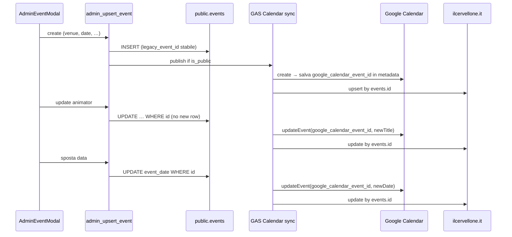

# Incidente duplicazione eventi — ilcervellone.it + Google Calendar

> **Documento-ponte** per il team GAS (`musicpro-eventi-app`)  
> Origine analisi: Love Game workspace · 2026-06-29  
> Aggiornare anche `musicpro-eventi-app/docs/SCHEMA_SOURCE_OF_TRUTH.md` dopo deploy migration.

---

## Sintomo

Eventi **Cervellone** (`game_format = 'cervellone'`) compaiono **due volte**:

1. Su **ilcervellone.it** — stessa data, stesso locale (es. IL DATTERINO 01/07, BLACK OUT 03/07).
2. Su **Google Calendar** — coppie affiancate con titoli leggermente diversi:
   - `Black Out - Da Assegnare` + `Black Out - Gabriele`
   - `Bar Lungomare - Dario` (indirizzo completo) + `Bar Lungomare - Dario` (titolo troncato)
   - `Trattoria Pedun - Dario` identico × 2

---

## Root cause (comportamento errato)

Il flusso attuale tratta **modifica** e **spostamento data** come **nuova creazione** in uno o più layer. Non è un bug di rendering: sono **record distinti** in DB e/o **eventi GCal distinti**.

### 1. Sync Google Calendar — lookup per titolo invece che per ID stabile

| Operazione admin | Comportamento attuale (errato) | Effetto |
|------------------|-------------------------------|---------|
| Creazione evento | `CalendarApp.createEvent(title, …)` | OK — primo evento GCal |
| Assegnazione animatore | Titolo cambia (`Da Assegnare` → nome) → sync cerca GCal per **nuovo titolo** → non trova → **create** | Duplicato GCal |
| Aggiornamento indirizzo locale | Titolo/descrizione cambia → stesso problema | Duplicato GCal |
| Spostamento data | Crea nuovo evento GCal sulla nuova data, **non cancella** il vecchio | Duplicato GCal + fantasma sulla data precedente |

**Correzione:** persistere `events.metadata.google_calendar_event_id` (o colonna dedicata) al primo publish. Tutte le sync successive devono fare `getEventById` + `update`, mai `create` se l'ID è valorizzato. Al cambio data: **update** della stessa entry GCal (o delete atomico del vecchio ID prima di salvare il nuovo).

### 2. `admin_upsert_event` — INSERT implicito su update / spostamento data

Se l'RPC o il client GAS:

- non passa `id` su update parziale, oppure
- rigenera `legacy_event_id` a ogni save (pattern simile a `LR-DEMO-${Date.now()}` nel seed Love Game), oppure
- su “sposta data” fa INSERT invece di `UPDATE event_date`,

→ si creano **due righe** in `public.events` per lo stesso locale/data.

**Correzione:** upsert keyed su `id` (UUID). `legacy_event_id` **solo in INSERT**, immutabile. Spostamento data = `UPDATE events SET event_date = … WHERE id = …` + sync GCal sullo stesso `google_calendar_event_id`.

### 3. `publish_cervellone` — doppio trigger su INSERT e UPDATE

Se `publish_cervellone` (o webhook Supabase → GAS → sito) si attiva su **ogni** UPDATE di `events` (es. cambio animatore, note, status), il sito può ricevere una seconda pubblicazione invece di un aggiornamento idempotente.

**Correzione:** publish idempotente keyed su `events.id`. Distinguere:

- `INSERT` + `is_public = true` → pubblica
- `UPDATE` → aggiorna record esistente sul sito (stesso id), **non** re-insert
- `UPDATE` con `status = 'cancelled'` → rimuovi dal sito

Non ripubblicare su cambi metadata interni (animatore, note_rounds) se già pubblicato.

### 4. Lista ilcervellone.it — nessun filtro anti-duplicato

La query/event feed del sito probabilmente fa `SELECT … FROM events WHERE is_public` senza:

- escludere `status IN ('cancelled', 'draft', …)`
- `DISTINCT ON (venue_id, event_date)` o vincolo UNIQUE a DB

**Correzione:** query con filtro status + vincolo DB (vedi migration sotto).

---

## Flusso corretto (target)



---

## Fix richiesti in `musicpro-eventi-app`

### A. Migration Supabase (canonica in `supabase/migrations/`)

Vedi script operativo: [`web/scripts/dedupe-cervellone-events.sql`](../web/scripts/dedupe-cervellone-events.sql)

1. Diagnostic query — elenca duplicati `(venue_id, event_date)` per `cervellone`.
2. Cleanup — tiene la riga con `metadata.google_calendar_event_id` o `updated_at` più recente; cancella/archivia le altre.
3. Vincolo — indice UNIQUE parziale:

```sql
CREATE UNIQUE INDEX IF NOT EXISTS events_cervellone_venue_date_active_uidx
  ON public.events (venue_id, event_date)
  WHERE game_format = 'cervellone'
    AND status NOT IN ('cancelled', 'deleted', 'draft');
```

4. (Opzionale) Colonna dedicata:

```sql
ALTER TABLE public.events
  ADD COLUMN IF NOT EXISTS google_calendar_event_id text;

CREATE UNIQUE INDEX IF NOT EXISTS events_google_calendar_event_id_uidx
  ON public.events (google_calendar_event_id)
  WHERE google_calendar_event_id IS NOT NULL;
```

### B. RPC `admin_upsert_event`

- Se `payload.id` presente → **solo UPDATE** (mai INSERT).
- `legacy_event_id` generato **una volta** in INSERT; vietato sovrascriverlo in UPDATE.
- Ritornare sempre `id` + `metadata` aggiornato (incluso `google_calendar_event_id`).

### C. Sync Google Calendar (GAS)

File tipici da verificare: handler post-upsert, `CalendarApp`, job di sync.

```javascript
// Pseudocodice corretto
function syncEventToGoogleCalendar(eventRow) {
  const cal = CalendarApp.getCalendarById(CALENDAR_ID);
  const gcalId = eventRow.metadata?.google_calendar_event_id
    ?? eventRow.google_calendar_event_id;

  const patch = buildGcalPatch(eventRow); // title, start, end, location

  if (gcalId) {
    const ev = cal.getEventById(gcalId);
    if (ev) {
      applyPatch(ev, patch);
      return gcalId;
    }
    // ID salvato ma evento cancellato manualmente su GCal → ricrea e aggiorna metadata
  }

  const created = cal.createEvent(patch.title, patch.start, patch.end, patch.opts);
  const newId = created.getId();
  saveGoogleCalendarEventId(eventRow.id, newId);
  return newId;
}
```

**Vietato:** `createEvent` quando esiste già `google_calendar_event_id`.  
**Vietato:** cercare evento GCal per `title` o `(venueName, date)` come chiave primaria.

### D. `publish_cervellone` / feed ilcervellone.it

- Upsert sul sito keyed su `events.id` (UUID Supabase).
- Query pubblica: `game_format = 'cervellone' AND is_public = true AND status NOT IN ('cancelled', …)`.
- Dopo cleanup DB, rigenerare cache/feed sito.

### E. Test di regressione

| # | Azione | Atteso |
|---|--------|--------|
| 1 | Crea evento Cervellone pubblico | 1 riga DB, 1 evento GCal, 1 riga sito |
| 2 | Assegna animatore | Stessi ID; titolo GCal aggiornato; **nessun** nuovo record |
| 3 | Sposta data +7 giorni | Stessa riga DB (`id` invariato); GCal spostato; sito mostra nuova data; **zero** righe sulla vecchia data |
| 4 | Doppio click Salva (race) | UNIQUE index → secondo INSERT fallisce o upsert no-op |
| 5 | Cancella evento | `status = cancelled`; rimosso da sito; GCal cancellato o marcato |

---

## Prompt da incollare in Cursor GAS

```
Incidente duplicazione eventi Cervellone — fix sync.

Leggi:
- Love Game/docs/23-event-sync-dedup-incident.md (questo incidente)
- Love Game/docs/13-platform-convergence-handoff.md (ponte Supabase)
- Love Game/web/scripts/dedupe-cervellone-events.sql (cleanup + constraint)

Task:
1. Applicare migration dedup + UNIQUE (venue_id, event_date) per cervellone attivi
2. admin_upsert_event: UPDATE by id only; legacy_event_id immutabile
3. Google Calendar sync: usare metadata.google_calendar_event_id, mai lookup per titolo
4. Spostamento data: UPDATE event_date + update GCal stesso ID (non create)
5. publish_cervellone: upsert by events.id, non re-insert su UPDATE animatore
6. Test regressione tabella §E del doc incidente
7. Aggiornare SCHEMA_SOURCE_OF_TRUTH.md
```

---

## Riferimenti Love Game (pattern analogo già mitigato)

| File | Pattern |
|------|---------|
| `web/src/lib/musicpro/demo-event.ts` | `ensureDemoEvent()` dedupa righe DEMO01 duplicate — stesso anti-pattern race INSERT |
| `web/scripts/seed-demo-event.sql` | `ON CONFLICT` su session — modello idempotenza da replicare su events |

---

## Stato handoff

| Task | Love Game | GAS | Stato |
|------|-----------|-----|-------|
| Analisi root cause | ✅ | — | OK |
| Script SQL dedup | ✅ | ⏳ apply | Da eseguire su Pro |
| Fix admin_upsert_event | — | ⏳ | Da implementare |
| Fix GCal sync | — | ⏳ | Da implementare |
| Fix publish_cervellone | — | ⏳ | Da implementare |
| Test regressione | — | ⏳ | Post-fix |
